# V2 Analysis Session UX

> **Info**
>
> Target product flow for V2 focus preparation, mode selection, analysis execution, and report provenance. This diagram describes target architecture, not current implementation or active process.

[Full-size diagram](../../../../diagrams/diagram-3ddb036828914470.svg) · [Mermaid source](../../../../diagrams/diagram-3ddb036828914470.mmd)

## Mode Summary

| Mode | Target user | Default | Product behavior |
|----|----|----|----|
| Unattended | Normal users | Yes | Selects a small recommended analysis focus and continues automatically when safe. |
| Attended | Advanced users | No | Pauses for focus confirmation and allows a broader configured focus. |
| Deep review | Admin/internal/expert | No | Uses an explicit per-run cap and review policy. |

The mode selector remains visible before each submission for now. The server, not the browser, is authoritative for allowed modes, caps, and forced-review conditions.

------------------------------------------------------------------------

**Navigation:** [Diagrams](../../../diagrams/index.md)
