# V2 Entity Model ERD

> **Info**
>
> Target V2 contract model. This diagram describes target architecture, not current implementation state. Names are logical contract names; implementation class names may differ if the same contract boundaries are preserved.

[Full-size diagram](../../../../diagrams/diagram-61ccb9bfc1628fc6.svg) · [Mermaid source](../../../../diagrams/diagram-61ccb9bfc1628fc6.mmd)
