# V2 Quality Gates Flow

> **Info**
>
> Target V2 trust flow: Gate 1, sufficiency, Gate 4, report integrity, and shared warning materiality. This diagram describes target architecture, not current implementation state.

[Full-size diagram](../../../../diagrams/diagram-ec2c38920b7626fc.svg) · [Mermaid source](../../../../diagrams/diagram-ec2c38920b7626fc.mmd)
