# V2 Report Regression Control

> **Info**
>
> Target promotion and rollback loop for V2 report-generation changes. This diagram describes target architecture, not current implementation state.

[Full-size diagram](../../../../diagrams/diagram-1005e3f001f4aada.svg) · [Mermaid source](../../../../diagrams/diagram-1005e3f001f4aada.mmd)

## Required Controls

| Control | Purpose |
|----|----|
| Versioned profile | Roll back prompt/model/config/rendering defaults without source-code rollback when possible. |
| Golden corpus | Compare against approved inputs and pinned deployed comparator reports, not current master V1. |
| Stored-packet replay | Test report-generation changes without paying for full research when upstream contracts are unchanged. |
| Difference classification | Separate improvement, neutral change, accepted tradeoff, and regression. |
| Promotion gate | Prevent default rollout until automated checks and focused review pass. |
| Provenance metadata | Make every public report traceable to profile, prompt/model/config, source commit, and evidence packet. |

------------------------------------------------------------------------

**Navigation:** [Diagrams](../../../diagrams/index.md)
