# V2 Verdict Debate Pattern

> **Info**
>
> Target verdict adjudication pattern. This diagram describes target architecture, not current implementation state. V2 preserves structured adversarial adjudication while routing prompt/model mechanics through the shared gateway.

[Full-size diagram](../../../../diagrams/diagram-6ef5493acf7447df.svg) · [Mermaid source](../../../../diagrams/diagram-6ef5493acf7447df.mmd)
