# Calculations and Verdicts V2

> **Info**
>
> **Target Calculation And Verdict Reference** - This page defines V2 verdict authority, aggregation boundaries, confidence ownership, and non-imported V1 formulas.
>
> This page describes target architecture, not current implementation state.

## Purpose

V2 keeps FactHarbor's user-facing verdict semantics while simplifying where calculation decisions live. The goal is one canonical verdict authority in `ReportResult`, derived from typed stage outputs and verified by quality gates.

## Verdict Scale

V2 preserves the current 7-point verdict scale and the MIXED/UNVERIFIED distinction:

| Verdict meaning | V2 requirement |
|----|----|
| TRUE to FALSE bands | Preserve the current public scale unless a separate product decision approves a change. |
| MIXED | Evidence exists on both sides and the system has enough confidence in the mixed state. |
| UNVERIFIED | Evidence is insufficient, inaccessible, or too weak for a trustworthy truth-direction call. |
| Truth percentage | Belongs to the canonical verdict contract, not to UI/API/export adapters. |
| Confidence | Belongs to Gate 4 and `ReportResult` confidence fields, not to scattered post-processors. |

## V2 Verdict Authority

[Full-size diagram](../../../../../../diagrams/diagram-6ee315fa402b18f7.svg) · [Mermaid source](../../../../../../diagrams/diagram-6ee315fa402b18f7.mmd)

`ReportResult` is the sole public authority for:

-   verdict label;
-   truth percentage;
-   confidence and confidence tier;
-   MIXED vs UNVERIFIED decision;
-   quality-gate state;
-   material warnings;
-   evidence references;
-   report-quality status.

Adapters consume this contract. They do not calculate replacement verdicts.

## Aggregation Boundary

V2 aggregation is responsible for structural and mathematical composition only after semantic judgments have been made by the relevant stages:

| Aggregation may do | Aggregation may not do |
|----|----|
| Combine per-boundary/per-claim verdicts according to approved contract rules. | Interpret claim meaning with regex, keyword lists, overlap scores, or language-specific rules. |
| Preserve selected AtomicClaim weights where an approved contract defines them. | Invent new claim priorities absent from the ClaimContract. |
| Project quality-gate and warning states into `ReportResult`. | Hide material warnings or downgrade damaged reports. |
| Compute public summary fields from `VerdictSet` and `BoundarySet`. | Re-run source reliability as a direct truth formula without an explicit design decision. |

## Report Generation Regression Control

# V2 Report Regression Control

> **Info**
>
> Target promotion and rollback loop for V2 report-generation changes. This diagram describes target architecture, not current implementation state.

[Full-size diagram](../../../../../../diagrams/diagram-1005e3f001f4aada.svg) · [Mermaid source](../../../../../../diagrams/diagram-1005e3f001f4aada.mmd)

## Required Controls

| Control | Purpose |
|----|----|
| Versioned profile | Roll back prompt/model/config/rendering defaults without source-code rollback when possible. |
| Golden corpus | Compare against approved inputs and pinned deployed comparator reports, not current master V1. |
| Stored-packet replay | Test report-generation changes without paying for full research when upstream contracts are unchanged. |
| Difference classification | Separate improvement, neutral change, accepted tradeoff, and regression. |
| Promotion gate | Prevent default rollout until automated checks and focused review pass. |
| Provenance metadata | Make every public report traceable to profile, prompt/model/config, source commit, and evidence packet. |

------------------------------------------------------------------------

**Navigation:** [Diagrams](../../../../../diagrams/index.md)

Report generation and narrative improvements must be rollback-safe:

-   every candidate uses a versioned report-generation profile;
-   comparison uses the same stored canonical packets where upstream evidence/verdict contracts are unchanged;
-   differences are classified as `improvement`, `neutral`, `accepted_tradeoff`, or `regression`;
-   semantic quality comparison uses an LLM-owned rubric or focused review, not keyword or surface-similarity scoring;
-   unresolved regressions block promotion and restore the previous approved profile.

`ReportResult` must carry profile, prompt/model/config, schema, renderer/export adapter, source commit, and replay/evidence-packet provenance so a future report-quality issue can be traced and rolled back.

## Doubted vs Contested

V2 keeps the evidence-backed contestation rule:

-   **contested** means counter-argumentation is backed by documented evidence and may affect truth percentage or confidence;
-   **doubted** means criticism, opinion, denial, or unsupported objection without adequate evidence and must not reduce verdict truth percentage or confidence by itself.

This distinction belongs to verdict adjudication and aggregation policy. It must remain multilingual and generic; no hardcoded political, domain, or language-specific terms are allowed.

## Confidence Contract

Gate 4 validates that verdict confidence is supported by:

-   cited evidence quality and coverage;
-   source and scope applicability;
-   evidence-backed contestation analysis;
-   uncertainty and scarcity signals;
-   citation, grounding, and direction integrity;
-   warning materiality.

Confidence calibration may apply approved structural calculations, but semantic meaning decisions remain LLM-owned. Any new thresholds or tunable weights that affect analysis output belong in UCM, not inline code.

## Source Reliability Disposition

V1 documentation includes direct source-reliability truth-percentage formulas. V2 does not adopt those formulas by default.

In V2:

-   source reliability is recorded as an observable signal in `EvidenceCorpus` and the run ledger;
-   adjudication may use source-trust information only through an approved prompt/config/model policy;
-   any direct source-reliability weighting in aggregation requires a separate decision, comparator evidence, and tests;
-   adapters must not apply hidden source-reliability adjustments.

## Explicit Non-Imports From V1

The following V1 mechanisms are historical/runtime documentation, not V2 target design:

-   direct source-reliability truth-percentage formulas;
-   deterministic semantic special-case guards;
-   vague phrase, keyword, or language-specific evidence scoring;
-   text-overlap or Jaccard-style semantic grouping;
-   adapter-side fallback verdict reinterpretation;
-   prompt examples copied into runtime without current prompt review.

## Cutover Verifiers

Before V2 verdict calculations can be public:

-   V2 fixture reports must cover TRUE/FALSE/MIXED/UNVERIFIED and damaged-result states.
-   Compatibility adapters must expose the same public verdict semantics as `ReportResult`.
-   Warning severity must match materiality policy.
-   Report-generation regression control must pass for narrative/result-writer changes, including golden-corpus comparison and rollback profile readiness.
-   Comparator review must include approved benchmark inputs and best available historical reports.
-   Live validation spend must happen only after commit, runtime refresh, and approved gate.

------------------------------------------------------------------------

**Navigation:** [Deep Dive Index](../../../../../specification/architecture/deep-dive/index.md) \| [Current Calculations and Verdicts](../../../../../specification/architecture/deep-dive/calculations-and-verdicts/index.md)
