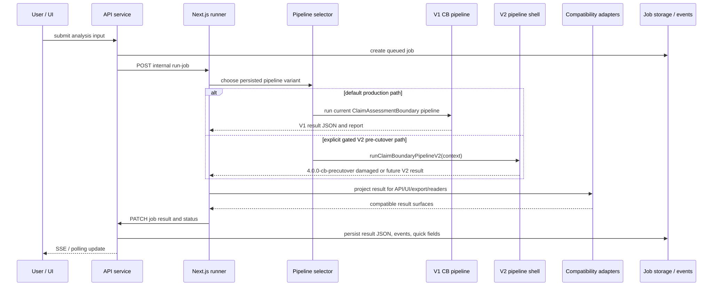

# Pipeline Variants V2

> **Info**
>
> **Target Variant And Cutover Reference** - This page defines how V2 can coexist with the current V1 runtime during rebuild, verification, cutover, and cleanup.
>
> This page describes target architecture, not current implementation state.

## Purpose

The V2 rebuild can use a temporary dual-variant posture so the current product remains stable while the replacement pipeline is built from clean contracts. The target end state is not a permanent twin-path system. V1 is retained only until V2 has equivalent contracts, adapters, validation evidence, a current cutover decision, and a completed stabilization window. After that, V1 analysis code should be removed; only historical report read compatibility remains. Old V1 behavior is investigated through old commits/worktrees, not by keeping V1 code in the forward architecture.

Design rationale: the current V1 pipeline is not the V2 quality target. V2 should not keep V1 code, prompts, or mechanisms active for comfort or backward investigation.

## Variant Lifecycle

# V2 Request Lifecycle

> **Info**
>
> Target request lifecycle for a controlled V2 replacement path. This diagram describes target architecture, not current implementation state.

[Full-size diagram](../../../../../../diagrams/diagram-331f96210376b11a.svg) · [Mermaid source](../../../../../../diagrams/diagram-331f96210376b11a.mmd)

| State | Runtime role | Public result authority | Exit condition |
|----|----|----|----|
| V1 default | Current ClaimAssessmentBoundary pipeline remains production runtime. | V1 result JSON and report remain public. | V2 contracts, adapters, and pre-cutover checks are ready. |
| V2 pre-cutover | V2 runs only when explicitly gated for development and cutover verification. | V1 remains public until cutover; V2 output is a development artifact. | Verification comparator, warning, schema, quality, cost, and latency gates pass. |
| V2 cutover | V2 produces public `4.0.0-cb` results through compatibility adapters. | `ReportResult` becomes public verdict authority. | Stability window confirms no critical regressions. |
| V1 cleanup | V1 hot-path and analysis code is removed where V2 owns the equivalent contract. | V2 remains public authority; legacy readers keep historical V1 readability through adapters/fixtures. | Cleanup ledger is complete, tests pass, and no V1 production analysis path remains. |

## Non-Negotiable Variant Rules

-   V1 remains the default runtime until a current cutover decision.
-   V2 starts isolated under `apps/web/src/lib/analyzer-v2/`.
-   V2 pre-cutover output must not replace public `resultJson` or `reportMarkdown` before a current cutover decision.
-   V2 may not skip Understand -\> Research -\> Boundary formation -\> Verdict -\> Aggregation/report.
-   V2 adapters may project `ReportResult`, but they may not reinterpret verdict, confidence, or warning meaning.
-   V2 internals may not reuse or clone V1 analysis code, prompt profiles, prompt files, or pipeline-owned types.
-   Current runner/job compatibility is limited to a one-way ingress mapping into V2-owned contracts.
-   V1 cleanup must follow a ledger: each removed V1 mechanism needs a V2 owner, verifier, and rollback/reader decision.
-   V1 prompt files, profiles, sections, and active prompt entries are removed from runtime selection once the corresponding V2 prompt-backed task is owned and verified.
-   The completed redesign must have no V1 production analysis pipeline left.

## Dispatch Model

[Full-size diagram](../../../../../../diagrams/diagram-20b17f3f9dd6503b.svg) · [Mermaid source](../../../../../../diagrams/diagram-20b17f3f9dd6503b.mmd)

## Compatibility Adapter Boundary

Compatibility adapters exist so UI, API, export, validation, metrics, and historical reads can remain stable while the pipeline internals change. Their permitted responsibilities are:

-   read canonical V2 fields;
-   project fields into current external shapes;
-   preserve historical V1 result readability;
-   report missing canonical fields as adapter/report integrity failures;
-   remain fixture-tested against V1 and V2 examples.

Compatibility adapters preserve data readability, not old behavior execution. They must not keep V1 callable for backward investigation; use Git history and old-commit worktrees for that.

Their forbidden responsibilities are:

-   calculating a different verdict;
-   downgrading or hiding material warnings;
-   inferring missing evidence or boundaries;
-   performing semantic text decisions;
-   calling V2 stage internals from external readers.

## Cutover Gate

V2 public cutover requires:

1.  contract and schema fixtures for every canonical public field;
2.  adapter parity tests for list/detail/report/export/validation readers;
3.  Analysis Session UX verification: visible mode selector before submission, Unattended default, Attended review path, forced-review conditions, selection-only focus changes, revise-input escape hatch, no job before finalized focus, and report focus provenance;
4.  quality-gate and warning-materiality tests;
5.  pre-cutover verification against approved benchmark inputs;
6.  comparator report review against accepted quality expectations;
7.  cost and latency review using measured baselines and the quality-constrained target envelope: normal 6-10 minutes / \$0.50-\$1.25, complex 10-18 minutes / \$1.25-\$3.25;
8.  documented quality-protection reason for any over-budget accepted run;
9.  retry and repair rates accepted as exceptional by focused review, with no hidden semantic repair or answer-fishing loop;
10. explicit current cutover decision.

## Cleanup Gate

After cutover, V1 removal happens in small cleanup steps and is required for redesign completion. A V1 mechanism can be removed only when:

-   the equivalent V2 owner is implemented and verified;
-   persisted historical reports remain readable;
-   fallback behavior is either unnecessary or explicitly retained in an adapter;
-   V1 prompt files/profiles/sections have no active runtime consumer for the replaced task;
-   documentation and handoff notes identify the removal decision.

The cleanup process preserves historical report readability, but it must not preserve V1 as a callable analysis variant.

------------------------------------------------------------------------

**Navigation:** [Deep Dive Index](../../../../../specification/architecture/deep-dive/index.md) \| [Current Pipeline Variants](../../../../../specification/architecture/deep-dive/pipeline-variants/index.md)
