# Source Reliability V2

> **Info**
>
> **Target Source Reliability Integration Reference** - This page defines how V2 consumes the existing Source Reliability service as an observable, versioned trust signal without adopting direct verdict formulas by default.
>
> This page describes target architecture, not current implementation state. The Source Reliability service, cache, prompt/config surface, and admin pages are not replaced by the V2 pipeline rebuild. V2 defines the pipeline-side consumption boundary only.

## Purpose

Source reliability is useful for evidence transparency, source portfolio review, and verdict reasoning. V2 keeps the existing shared service and consumes its signal through a clear integration boundary, while avoiding hidden or premature coupling between source-reliability scores and public truth percentages.

## V2 Position

| Topic | V2 decision |
|----|----|
| Source reliability exists | Yes. It remains a source-trust signal that can be cached, audited, and shown to reviewer-facing or admin-facing surfaces. |
| Service implementation | Unchanged for the pipeline rebuild. Reuse the existing service/cache/admin surfaces behind a thin V2 consumption port. |
| Source reliability is semantic | Yes. Evaluation of source credibility, independence, expertise, and bias is LLM-owned unless a structural field is being validated. |
| Direct verdict weighting | Not adopted by default. Requires later architecture review, comparator evidence, and tests. |
| Storage and cache | Records must be versioned by provider/model/prompt/config/schema dimensions where those affect the signal. |
| Evidence integration | Signals attach to sources/EvidenceItems in `EvidenceCorpus` and the run ledger. |

## Integration Flow

[Full-size diagram](../../../../../../diagrams/diagram-3ff6b11d758ba986.svg) · [Mermaid source](../../../../../../diagrams/diagram-3ff6b11d758ba986.mmd)

## Signal Contract

A V2 SourceReliabilitySignal should record:

-   source identity and domain/source key;
-   model/provider/prompt/config version used for evaluation;
-   credibility band or score if approved by the source-reliability contract;
-   rationale and important caveats;
-   freshness/staleness metadata;
-   relation to EvidenceItems that used the source;
-   cache hit/miss/stale status;
-   whether the signal was exposed to verdict adjudication.

## Allowed And Forbidden Uses

| Allowed in V2 | Forbidden without later review |
|----|----|
| Show source-trust signals in evidence diagnostics. | Apply a direct truth-percentage multiplier from source reliability. |
| Help reviewers understand source portfolio balance. | Let adapters adjust verdicts based on source reliability. |
| Provide approved adjudication context through the prompt/model gateway. | Hardcode domain, outlet, country, language, or topic-specific source weights. |
| Cache and reuse identical/equivalent source evaluations. | Treat search-provider rank as source credibility. |
| Surface stale/missing SR as admin diagnostics where non-material. | Hide material evidence degradation behind source reliability fallback values. |
| Wrap the existing service in a V2 source-trust port. | Fork, clone, or rename the Source Reliability service just because the pipeline is V2. |

## Relationship To Evidence And Verdicts

Source reliability is not a substitute for evidence applicability. A highly reliable source can still be irrelevant to the AtomicClaim, outside the EvidenceScope, or too indirect for probative value. A less established source can still supply primary evidence if the content, scope, and provenance support it.

V2 verdict adjudication must therefore consider source reliability only alongside evidence content, applicability, scope, citation integrity, and contestation. Any policy that gives source reliability numerical influence over truth percentage must be validated against comparator reports before cutover.

## Warning Policy

Source reliability events follow the shared warning materiality test:

-   cache miss recovered by live evaluation: silent;
-   stale signal used only as an admin diagnostic: admin-only info;
-   source portfolio uncertainty that materially lowers trust: user-visible warning;
-   source-reliability infrastructure failure that prevents required adjudication policy from running: error or damaged-report path depending on impact.

## Links

-   [Quality and Trust V2](../../quality-and-trust-v2/index.md)
-   [Evidence Lifecycle V2](../evidence-lifecycle-v2/index.md)
-   [Calculations and Verdicts V2](../calculations-and-verdicts-v2/index.md)
-   [External Dependencies](../../../../../specification/architecture/external-dependencies/index.md)

------------------------------------------------------------------------

**Navigation:** [Deep Dive Index](../../../../../specification/architecture/deep-dive/index.md) \| [Current Source Reliability](../../../../../specification/architecture/deep-dive/source-reliability/index.md)
