# Data Model

FactHarbor's data model centres on the **analysis result** — a structured representation of how claims are decomposed, researched, and evaluated. This page defines the complete entity landscape derived from the source code, the 7-point verdict scale, and the job lifecycle.

## Entity Overview

The following diagram shows all major entity groups and their primary relationships at a glance. For detailed views (result fields, target database, runtime entities, UI visibility), see [Entity Views](../../../diagrams/entity-views/index.md).

## Overview ERD

Bird's-eye view showing all major entity groups and their primary relationships. Minimal field detail -- use the other views for field-level information.

[Full-size diagram](../../../../diagrams/diagram-a70448a0428a4ac5.svg) · [Mermaid source](../../../../diagrams/diagram-a70448a0428a4ac5.mmd)

*Overview: JOB produces an ANALYSIS_RESULT containing decomposed claims (CB_CLAIM_UNDERSTANDING with ATOMIC_CLAIMs), per-claim verdicts (CB_CLAIM_VERDICT with per-boundary BOUNDARY_FINDINGs) supported by evidence (EVIDENCE_ITEM) from web sources (FETCHED_SOURCE), grouped into evidence-emergent CLAIM_BOUNDARYs, and aggregated into an OVERALL_ASSESSMENT with VERDICT_NARRATIVE and COVERAGE_MATRIX. Quality validation (QUALITY_GATES) and a user-facing summary (TWO_PANEL_SUMMARY) complete the result. SOURCE_RELIABILITY provides cached domain-level trust scores for FETCHED_SOURCEs.*

------------------------------------------------------------------------

## Analysis Entity Model

The ClaimAssessmentBoundary pipeline produces a hierarchy of entities: the input is decomposed into AtomicClaims (Stage 1), evidence is gathered from web sources (Stage 2), evidence is clustered into ClaimAssessmentBoundaries (Stage 3), verdicts are generated per-claim via LLM debate (Stage 4), and aggregated into an OverallAssessment (Stage 5).

> **Info**
>
> **Current Implementation (CB Pipeline v2.11.0+)** — The complete analysis entity hierarchy from input through verdict to overall assessment. Source of truth: `apps/web/src/lib/analyzer/types.ts` (CB pipeline interfaces: `CBClaimUnderstanding`, `AtomicClaim`, `CBClaimVerdict`, `BoundaryFinding`, `ClaimAssessmentBoundary`, `EvidenceItem`, `EvidenceScope`, `FetchedSource`, `OverallAssessment`, `VerdictNarrative`, `ConsistencyResult`, `ChallengeResponse`, `CoverageMatrix`, `TriangulationScore`).
>
> Updated 2026-02-22.

# Analysis Entity Model (CB Pipeline v2.11.0+)

## Entity Relationship Diagram

[Full-size diagram](../../../../diagrams/diagram-cb95db6bc106e37c.svg) · [Mermaid source](../../../../diagrams/diagram-cb95db6bc106e37c.mmd)

*The CB pipeline analysis entity hierarchy. Stage 1 (Extract Claims) produces `CB_CLAIM_UNDERSTANDING` with `AtomicClaims` and `GATE_1_STATS`. Stage 2 (Research) gathers `EVIDENCE_ITEMs` with `EVIDENCE_SCOPEs` from `FETCHED_SOURCEs`. Stage 3 (Cluster) groups `EVIDENCE_SCOPEs` into `CLAIM_ASSESSMENT_BOUNDARYs`. Stage 4 (Verdict) generates `CB_CLAIM_VERDICTs` with per-boundary `BOUNDARY_FINDINGs`, `CONSISTENCY_RESULTs` (self-consistency), `TRIANGULATION_SCOREs` (cross-boundary agreement), and `CHALLENGE_RESPONSEs` (adversarial debate). Stage 5 (Aggregate) produces `OVERALL_ASSESSMENT` with `VERDICT_NARRATIVE`, `COVERAGE_MATRIX`, and `QUALITY_GATES`.*

## Entity Hierarchy

The CB pipeline produces a result structure organized as follows:

1.  **CBClaimUnderstanding** (Stage 1 output) — Top-level understanding of the input. Contains the extracted `atomicClaims[]` array and `gate1Stats` validation summary. Captures the article thesis, background details, risk tier, distinct events, and preliminary evidence gathered during the two-pass extraction process.

<!-- -->

1.  **AtomicClaim** — A single verifiable assertion extracted from user input. Only central claims (high/medium centrality) survive the extraction filter. Each carries `expectedEvidenceProfile` describing what evidence types and methodologies would verify or refute it. Fields `verifiability` (B-6) and `groundingQuality` assess fact-checkability and evidence anchoring.

<!-- -->

1.  **CBClaimVerdict** (Stage 4 output) — One verdict per AtomicClaim, not per boundary. The verdict integrates evidence across all boundaries into a single `truthPercentage` and 7-point `verdict` label. Boundary-specific nuance is captured in `boundaryFindings[]`. Includes `consistencyResult` (self-consistency check), `triangulationScore` (cross-boundary agreement), and `challengeResponses[]` (adversarial debate reconciliation). Optional `misleadingness` (B-7) provides an independent assessment that is output-only and not fed back into the debate.

<!-- -->

1.  **BoundaryFinding** — Per-boundary quantitative signals within a CBClaimVerdict. Records `truthPercentage`, `confidence`, `evidenceDirection`, and `evidenceCount` for one ClaimAssessmentBoundary. Provides nuance when different methodological boundaries yield different conclusions about the same claim.

<!-- -->

1.  **EvidenceItem** (Stage 2 output) — Extracted evidence from a source. This is unverified material to be evaluated against claims — not a verified fact. Linked to a `FetchedSource` via `sourceId` and carries an `EvidenceScope` describing the source methodology. Assigned to a `ClaimAssessmentBoundary` in Stage 3 via `claimBoundaryId`.

<!-- -->

1.  **EvidenceScope** — Per-evidence source metadata describing the methodology, boundaries, geography, and timeframe of the source data. Embedded within EvidenceItem (not a separate stored entity). Extensible via `additionalDimensions` (Decision D4). Compatible scopes are clustered into ClaimAssessmentBoundaries in Stage 3.

<!-- -->

1.  **ClaimAssessmentBoundary** (Stage 3 output) — Evidence-emergent grouping of compatible EvidenceScopes. Created after research by clustering scopes with compatible methodology, temporal, and geographic dimensions. Contains `constituentScopes[]` and measures `internalCoherence` (0-1).

<!-- -->

1.  **OverallAssessment** (Stage 5 output) — Final aggregated result. Weighted average of `truthPercentage` and `confidence` across all CBClaimVerdicts. Contains `verdictNarrative` (structured narrative), `coverageMatrix` (claims x boundaries evidence distribution), `qualityGates` (Gate 1 and Gate 4 results), `claimBoundaries[]`, and `claimVerdicts[]`. Optional `explanationQualityCheck` (B-8) provides structural and rubric-based quality assessment of the narrative.

## Key Implementation Notes

**7-Point Verdict Scale:**

-   TRUE (86-100%) / MOSTLY-TRUE (72-85%) / LEANING-TRUE (58-71%)
-   MIXED (43-57%, confidence \>= 40%) / UNVERIFIED (43-57%, confidence \< 40%)
-   LEANING-FALSE (29-42%) / MOSTLY-FALSE (15-28%) / FALSE (0-14%)

**EvidenceScope (mandatory core fields):** Per-evidence metadata describing the methodology and boundaries of the source data. `methodology` and `temporal` are the primary scope dimensions populated when available from the source. All fields except `name` are optional in the TypeScript interface, but the extraction prompt targets methodology and temporal as mandatory when source data permits. Embedded in EvidenceItem, not a separate stored entity. Extensible via `additionalDimensions` (Decision D4).

**harmPotential (4-level, Decision D9):** `critical` (1.5x weight) = death/injury allegations, `high` (1.2x) = serious but not life-threatening, `medium` (1.0x) = moderate, `low` (1.0x) = minimal. Applied to both AtomicClaim and CBClaimVerdict.

**claimDirection semantics (Decision D6):** AtomicClaim uses `supports_thesis` / `contradicts_thesis` / `contextual` (contextual = relevant background without directional stance). EvidenceItem uses `supports` / `contradicts` / `neutral` for backward compatibility.

**Derivative evidence (CB pipeline):** Evidence items that cite another source's underlying study are flagged with `isDerivative` and `derivedFromSourceUrl`. If the original source was not fetched, `derivativeClaimUnverified` = true. Derivative evidence receives reduced weight in aggregation.

**VerdictNarrative (Decision D7):** Structured type with `headline`, `evidenceBaseSummary`, `keyFinding`, `boundaryDisagreements[]`, and `limitations`. LLM-generated (Sonnet, 1 call) after weighted aggregation. Stored within OverallAssessment.

**Self-Consistency (Stage 4 Step 2):** CBClaimVerdict includes `consistencyResult` recording the spread of truth percentages across multiple LLM runs with temperature \> 0. The `stable` flag indicates whether spread is below the UCM-configured threshold. If `assessed` is false, the check was skipped (disabled or deterministic mode).

**Triangulation (Stage 4):** CBClaimVerdict includes `triangulationScore` measuring cross-boundary agreement: `strong` / `moderate` / `weak` / `conflicted`. The `factor` field provides a multiplicative weight adjustment derived from UCM thresholds.

**Adversarial Challenge (Stage 4 Steps 3-4):** CBClaimVerdict includes `challengeResponses[]` recording how each adversarial challenge point was addressed in reconciliation. Challenges must be evidence-backed to adjust verdicts; unsubstantiated objections do not reduce truth percentage. Each response records `challengeType`, `response`, `verdictAdjusted`, and optional `adjustmentBasedOnChallengeIds` for provenance tracking.

**Misleadingness (B-7):** Optional independent assessment on CBClaimVerdict. Values: `not_misleading`, `potentially_misleading`, `highly_misleading`. Output-only; not fed back into the debate.

**TruthPercentageRange:** Plausible range (`min`, `max`) computed from self-consistency spread and optionally widened by boundary variance. Present on both CBClaimVerdict and OverallAssessment.

**Explanation Quality (B-8):** Optional `explanationQualityCheck` on OverallAssessment. Two tiers: structural (deterministic — checks for cited evidence, verdict category, confidence statement, limitations) and rubric (LLM-powered — scores clarity, completeness, neutrality, evidence support, appropriate hedging on a 1-5 scale).

**Storage:** All data stored as JSON blob in SQLite `ResultJson` field. Schema version: `3.0.0-cb`.

**See Also:** [Entity Views](../../../diagrams/entity-views/index.md) for multi-view field-level detail. [Quality Gates Flow](../../../diagrams/quality-gates-flow/index.md) for Gate 1 and Gate 4 detail.

*For complete field-level detail per entity and per pipeline phase, see [Entity Views](../../../diagrams/entity-views/index.md).*

## Entity Descriptions

| Entity | Purpose | Source Interface | Key Relationships |
|----|----|----|----|
| **CBClaimUnderstanding** | Stage 1 output: decomposition of input into AtomicClaims with Gate 1 stats and preliminary evidence | `types.ts:942` | Parent of AtomicClaim\[\]; contains gate1Stats and preliminaryEvidence |
| **AtomicClaim** | Single verifiable assertion extracted from user input; the analytical unit. Only central claims (high/medium centrality) survive extraction. | `types.ts:715` | Receives CBClaimVerdict\[\]; has centrality, harmPotential, groundingQuality, expectedEvidenceProfile |
| **ClaimAssessmentBoundary** | Evidence-emergent grouping of compatible EvidenceScopes; the top-level analytical frame. Created post-research by clustering EvidenceScopes. | `types.ts:747` | Contains EvidenceItem\[\] and constituentScopes\[\]; referenced by BoundaryFinding\[\]; has internalCoherence |
| **CBClaimVerdict** | Per-claim verdict with truth percentage, confidence, reasoning, boundary findings, challenge responses, and misleadingness assessment | `types.ts:791` | References EvidenceItem\[\] (supporting + contradicting); contains BoundaryFinding\[\], ConsistencyResult, ChallengeResponse\[\], TriangulationScore, TruthPercentageRange |
| **EvidenceItem** | Extracted statement with quality metadata (probativeValue, searchStrategy, scopeQuality, sourceType, derivative tracking) | `types.ts:385` | References FetchedSource; assigned to ClaimAssessmentBoundary via claimBoundaryId; has EvidenceScope |
| **FetchedSource** | Web source with URL, content, and source reliability score (0.0-1.0 from LLM evaluation, with confidence and consensus) | `types.ts:447` | Referenced by EvidenceItem\[\] |
| **OverallAssessment** | Final aggregated result: weighted truth percentage, verdict, confidence, narrative, coverage matrix, quality gates, and explanation quality check | `types.ts:1035` | Aggregates CBClaimVerdict\[\], ClaimAssessmentBoundary\[\]; has VerdictNarrative, CoverageMatrix, QualityGates, ExplanationQualityCheck, TruthPercentageRange |
| **VerdictNarrative** | Structured narrative: headline, evidence base summary, key finding, boundary disagreements, limitations | `types.ts:927` | Contained by OverallAssessment |

### Additional Entities

-   **EvidenceScope** (`types.ts:226`) — Per-evidence methodology metadata (methodology \[optional\], temporal \[optional\], boundaries, geographic, sourceType, additionalDimensions). All fields except `name` are optional; populated when available from the source. Embedded in EvidenceItem.
-   **BoundaryFinding** (`types.ts:773`) — Per-boundary quantitative signals within a CBClaimVerdict: boundaryId, boundaryName, truthPercentage, confidence, evidenceDirection, evidenceCount.
-   **ConsistencyResult** (`types.ts:820`) — Self-consistency check output: verdict stability across multiple LLM runs (percentages\[\], average, spread, stable flag, assessed flag).
-   **ChallengeDocument** (`types.ts:845`) — Output of the adversarial challenge step (Stage 4, Step 3): contains per-claim arrays of ChallengePoints.
-   **ChallengePoint** (`types.ts:857`) — A single adversarial challenge against a verdict: id, type (assumption/missing_evidence/methodology_weakness/independence_concern), description, evidenceIds, severity, challengeValidation.
-   **ChallengeValidation** (`types.ts:874`) — Structural validation of a challenge point's evidence references: evidenceIdsValid, validIds\[\], invalidIds\[\]. Populated by `validateChallengeEvidence()` before reconciliation.
-   **ChallengeResponse** (`types.ts:885`) — How adversarial challenges were addressed in reconciliation: challengeType, response, verdictAdjusted, adjustmentBasedOnChallengeIds.
-   **TriangulationScore** (`types.ts:898`) — Cross-boundary agreement assessment: supporting/contradicting boundary counts, level (strong/moderate/weak/conflicted), factor.
-   **CoverageMatrix** (`types.ts:912`) — Claims x boundaries evidence distribution: claim IDs (rows), boundary IDs (columns), counts\[\]\[\] per cell. Provides `getBoundariesForClaim()` and `getClaimsForBoundary()` accessors.
-   **TruthPercentageRange** (`types.ts:835`) — Plausible range for a truth percentage verdict (min, max), computed from self-consistency spread and optionally widened by boundary variance. Attached to both CBClaimVerdict and OverallAssessment.
-   **CBResearchState** (`types.ts:971`) — Top-level research container holding CBClaimUnderstanding, EvidenceItem\[\], FetchedSource\[\], SearchQuery\[\], query budget tracking, iteration tracking, ClaimAssessmentBoundary\[\], and accumulated AnalysisWarning\[\].

### Explanation Quality Entities (B-8)

-   **ExplanationQualityCheck** (`types.ts:1023`) — Explanation quality check result, attached to OverallAssessment: mode (structural or rubric), structuralFindings, rubricScores (when mode is rubric).
-   **ExplanationStructuralFindings** (`types.ts:998`) — Tier 1 deterministic structural check: hasCitedEvidence, hasVerdictCategory, hasConfidenceStatement, hasLimitations.
-   **ExplanationRubricScores** (`types.ts:1009`) — Tier 2 LLM-powered rubric evaluation: clarity, completeness, neutrality, evidenceSupport, appropriateHedging (each scored 1-5), overallScore (weighted average), flags\[\].

## Quality Gate Entities

Two quality gates produce validation entities that attach to the analysis result.

| Entity | Gate | Purpose | Key Fields | Source |
|----|----|----|----|----|
| **ClaimValidationResult** | Gate 1 | Per-claim factuality + fidelity check | `isFactual`, `opinionScore`, `specificityScore`, `claimType`, `passed` | `types.ts:105` |
| **VerdictValidationResult** | Gate 4 | Per-verdict confidence assessment | `evidenceCount`, `averageSourceQuality`, `evidenceAgreement`, `confidenceTier` | `types.ts:121` |
| **QualityGates** | Both | Aggregate pass/fail with Gate1Stats and Gate4Stats | `passed`, `gate1Stats`, `gate4Stats`, `summary` | `types.ts:172` |

Gate 1 statistics (`Gate1Stats`, `types.ts:137`) track total claims evaluated, passed, filtered, and central claims kept despite failing validation. The CB pipeline's `CBClaimUnderstanding.gate1Stats` additionally tracks `passedFidelity` — the count of claims passing the fidelity check.

Gate 4 statistics (`Gate4Stats`, `types.ts:148`) track verdict confidence distribution across HIGH, MEDIUM, LOW, and INSUFFICIENT tiers.

For detailed quality gate criteria and examples, see [Quality Gates Deep Dive](../deep-dive/quality-gates/index.md).

## Configuration Entities

Four configuration profiles are stored as immutable JSON blobs in the UCM (Unified Config Management) system. Each analysis job records the exact config snapshot used for reproducibility.

| Config | Purpose | Key Settings | Source |
|----|----|----|----|
| **PipelineConfig** | Pipeline operational settings | LLM provider selection, model tiering, budget controls, context detection, confidence calibration | `config-schemas.ts:86` |
| **CalcConfig** | Calculation and aggregation | Verdict bands, centrality weights, contestation penalties, quality gate thresholds, deduplication | `config-schemas.ts:751` |
| **SearchConfig** | Search provider settings | Provider selection, max results, timeout, domain whitelist/blacklist | `config-schemas.ts:52` |
| **SourceReliabilityConfig** | Source reliability service | Multi-model consensus, confidence/consensus thresholds, cache TTL, platform skip lists | `config-schemas.ts:598` |

For configuration storage and versioning, see [Storage and Configuration](../storage-and-configuration/index.md).

## 7-Point Verdict Scale

# Verdict Scale

[Full-size diagram](../../../../diagrams/diagram-4091dd3ff83a9f64.svg) · [Mermaid source](../../../../diagrams/diagram-4091dd3ff83a9f64.mmd)

*The 7-point verdict scale maps truth percentages to verdict labels. MIXED (evidence on both sides, confidence \>= 40%) and UNVERIFIED (insufficient evidence, confidence \< 40%) share the same percentage range but differ in their confidence interpretation.*

| Verdict | Truth % Range | Meaning |
|----|----|----|
| **TRUE** | 86-100% | Claim is well-supported by strong evidence |
| **MOSTLY TRUE** | 72-85% | Claim is largely supported with minor caveats |
| **LEANING TRUE** | 58-71% | More evidence supports than contradicts, but not conclusive |
| **MIXED** | 43-57% (confidence \>= 40%) | Significant evidence on both sides |
| **UNVERIFIED** | 43-57% (confidence \< 40%) | Insufficient evidence to determine truth |
| **LEANING FALSE** | 29-42% | More evidence contradicts than supports |
| **MOSTLY FALSE** | 15-28% | Claim is largely contradicted by evidence |
| **FALSE** | 0-14% | Claim is strongly contradicted by evidence |

### MIXED vs. UNVERIFIED

Both occupy the 43-57% truth range. The distinction is **confidence-based**:

-   **MIXED**: The system found substantial evidence but it points in opposing directions (high confidence in the conflict)
-   **UNVERIFIED**: The system could not find enough evidence to make a determination (low confidence due to insufficient data)

## Job Lifecycle

# Job Lifecycle ERD

[Full-size diagram](../../../../diagrams/diagram-6ddcdfb5e0ee74d2.svg) · [Mermaid source](../../../../diagrams/diagram-6ddcdfb5e0ee74d2.mmd)

*Jobs progress through a lifecycle: QUEUED -\> RUNNING -\> SUCCEEDED or FAILED. If the system auto-pauses due to provider outage, jobs remain QUEUED until processing resumes. Events are logged at each stage and streamed to the client via SSE.*

### Job Status Transitions

| Status | Meaning |
|----|----|
| **QUEUED** | Job submitted, waiting for runner capacity |
| **RUNNING** | ClaimAssessmentBoundary pipeline is executing |
| **SUCCEEDED** | Analysis complete, results available |
| **FAILED** | Analysis failed (provider error, timeout, or input issue) |
| **PAUSED** | System auto-paused due to provider outage (jobs resume when system recovers) |

## Audit Trail

> **Info**
>
> **Implementation Status (v2.10.2)** — Current implementation uses `JobEvents` for job execution logs and UCM config tables for configuration versioning. Analysis output data is **immutable** and never edited. All audit tracking is on UCM configuration changes and job execution, not on data edits.

# Current Implementation: Job Execution Audit

[Full-size diagram](../../../../diagrams/diagram-5e7eb50583e27680.svg) · [Mermaid source](../../../../diagrams/diagram-5e7eb50583e27680.mmd)

**Current audit capabilities:**

-   Job creation and completion timestamps
-   Job execution events (start, progress, errors)
-   Immutable analysis results (JSON blobs)
-   No user attribution needed (anonymous submission model)

# UCM Configuration Audit Trail

[Full-size diagram](../../../../diagrams/diagram-da7eab816e734908.svg) · [Mermaid source](../../../../diagrams/diagram-da7eab816e734908.mmd)

**UCM audit capabilities:**

-   Every config change stored as immutable blob (content-addressed by hash)
-   Activation history: which config was active when, changed by whom
-   Per-job config snapshots: every analysis references the exact config used
-   Full reproducibility: re-run any analysis with its original config

# Design Principles

-   **Analysis data is immutable** — never edited after creation
-   **Improve the system, not the data** — quality improvements flow through UCM config changes
-   **Every report references its config** — via `config_usage` linking job to config snapshot
-   **Config blobs are never deleted** — complete audit trail preserved

See [Data Model](../../data-model/index.md) for complete architecture.

## Storage

Analysis results are currently stored as **JSON blobs** in SQLite (via the .NET Entity Framework `ResultJson` field). The full entity model above lives within this JSON blob — it is not normalised into separate database tables.

| Database | Technology | Contents |
|----|----|----|
| `factharbor.db` | .NET Entity Framework Core | Jobs, events, analysis results (JSON), metrics |
| `config.db` | Next.js better-sqlite3 | UCM configuration blobs, activation pointers, usage tracking |
| `source-reliability.db` | Next.js better-sqlite3 | Source credibility evaluation cache |

**Target Evolution:** PostgreSQL for primary storage (enabling full-text search, user accounts), with the JSON blob approach preserved for backwards compatibility during migration. See [Storage and Configuration](../storage-and-configuration/index.md) for details, and [Target Data Model](../../data-model/index.md) for the normalised design specification.

## Deep Dives

-   [Calculations and Verdicts](../deep-dive/calculations-and-verdicts/index.md) — Verdict calculation formulas, aggregation hierarchy, weighting factors
-   [Confidence Calibration](../deep-dive/confidence-calibration/index.md) — 4-layer confidence system, penalty calculations

------------------------------------------------------------------------

**Navigation:** [Architecture](../index.md) \| Prev: [AKEL Pipeline](../../../../akel-pipeline.md) \| Next: [External Dependencies](../external-dependencies/index.md)
