# Boundary Clustering and EvidenceScope Detection

> **Info**
>
> **Developer Reference** — How FactHarbor clusters evidence into ClaimBoundaries and detects EvidenceScope metadata across the pipeline.
>
> **Key File**: `apps/web/src/lib/analyzer/claimboundary-pipeline.ts` (Stage 3: CLUSTER BOUNDARIES)

------------------------------------------------------------------------

## 1. Overview

This guide explains:

-   **What** ClaimBoundaries and EvidenceScopes are (definitions)
-   **When** to extract EvidenceScope vs create ClaimBoundary (stage timing)
-   **How** boundaries are clustered from evidence (congruence-based flow)
-   **Why** the system uses evidence-emergent boundaries (approach)
-   **Where** the implementation lives (code references)

------------------------------------------------------------------------

## 2. Terminology

<span id="2-1-core-definitions"></span>

### 2.1 Core Definitions

**ClaimBoundary** (Evidence-Emergent Grouping):

-   An evidence-emergent grouping of compatible EvidenceScopes
-   **Created**: AFTER research (Stage 3: CLUSTER BOUNDARIES)
-   **Example**: "Methodology A Studies" (evidence using compatible Framework A scopes)
-   **Storage**: `claimBoundaries` array, `evidenceItem.claimBoundaryId`
-   **Purpose**: Organize evidence for per-claim verdict generation with per-boundary findings

**EvidenceScope** (Per-Evidence Source Metadata):

-   Metadata about a single evidence item's methodology, boundaries, temporal, and geographic constraints
-   **Created**: DURING research (Stage 2: RESEARCH, per evidence item)
-   **Example**: "Standard S, Period P data, Full system boundary"
-   **Storage**: `evidenceItem.evidenceScope` object (MANDATORY)
-   **Purpose**: Capture source's analytical frame so compatible evidence can be clustered

**Key Distinction**:

-   **EvidenceScope** = "What methodology/boundaries did THIS source use?" (per-evidence metadata)
-   **ClaimBoundary** = "Which evidence items can be grouped together?" (cluster of compatible EvidenceScopes)

<span id="2-2-terminology-usage-rules"></span>

### 2.2 Terminology Usage Rules

**FactHarbor ClaimBoundary Pipeline Entities** (use in prompts and code):

-   **AtomicClaim**: Single verifiable assertion extracted from user input
-   **EvidenceItem**: Information extracted from sources (with EvidenceScope)
-   **EvidenceScope**: Per-evidence source methodology metadata
-   **ClaimBoundary**: Evidence-emergent grouping of compatible EvidenceScopes
-   **ClaimVerdict**: Per-claim verdict with boundaryFindings\[\]
-   **BoundaryFinding**: Per-boundary quantitative assessment for a specific claim

**NEVER use in new code**:

-   \~~AnalysisContext\~~ → Use **ClaimBoundary**
-   \~~contextId\~~ → Use **claimBoundaryId**
-   \~~analysisContexts\~~ → Use **claimBoundaries**
-   \~~scope\~~ (ambiguous) → Use **EvidenceScope** or **ClaimBoundary** explicitly

------------------------------------------------------------------------

## 3. EvidenceScope vs ClaimBoundary Decision Tree

# Boundary Clustering Decision Flow


[Full-size diagram](../../../../../diagrams/diagram-0ed4a5e93143f84c.svg) · [Mermaid source](../../../../../diagrams/diagram-0ed4a5e93143f84c.mmd)

*Yellow = EvidenceScope extraction. Green = single boundary (compatible). Orange = multiple boundaries (incompatible). Blue = verdict stage.*

<span id="3-1-when-to-extract-evidencescope-always"></span>

### 3.1 When to Extract EvidenceScope (Always)

Extract EvidenceScope metadata for EVERY evidence item during Stage 2: RESEARCH:

1.  **Source states methodology**: "This study uses Standard S"
2.  **Source has temporal boundaries**: "Data from Period P to Period Q"
3.  **Source has system boundaries**: "Full system boundary" vs "Subsystem only"
4.  **Source has geographic scope**: "Jurisdiction J" vs "Region R"

**Primary fields** (always extracted when source provides them; optional in TypeScript type):

-   `methodology` — The analytical approach used by the source
-   `temporal` — When the source data was collected or applies

**Optional fields**:

-   `boundaries` — What was included/excluded in the analysis
-   `geographic` — Geographic scope of the source data
-   `additionalDimensions` — Domain-specific scope data (e.g., sample size, blinding)

<span id="3-2-when-claimboundaries-are-created-stage-3"></span>

### 3.2 When ClaimBoundaries Are Created (Stage 3)

ClaimBoundaries are created AFTER research by clustering compatible EvidenceScopes:

1.  **Compatible EvidenceScopes**: Cluster into single ClaimBoundary

1\*. All evidence uses "Standard S, Period P" → 1 boundary

1.  **Incompatible methodologies**: Create separate ClaimBoundaries

1\*. "Methodology A (full system)" vs "Methodology B (subsystem)" → 2 boundaries

1.  **Different jurisdictions**: Create separate ClaimBoundaries

1\*. "Jurisdiction J" vs "Jurisdiction K" → 2 boundaries

1.  **Different temporal periods**: May create separate boundaries if temporal is primary subject

1\*. "Period P" vs "Period Q" → potentially 2 boundaries

------------------------------------------------------------------------

## 4. Pipeline Flow

<span id="4-1-five-stage-claimboundary-pipeline"></span>

### 4.1 Five-Stage ClaimBoundary Pipeline

# ClaimBoundary Pipeline Stages



[Full-size diagram](../../../../../diagrams/diagram-06589d41853a8b00.svg) · [Mermaid source](../../../../../diagrams/diagram-06589d41853a8b00.mmd)

*Orange = claim extraction (two-pass). Yellow = EvidenceScope extraction (mandatory). Green = boundary clustering (congruence). Blue = boundaries + verdicts. Purple = final report.*

<span id="4-2-stage-breakdown"></span>

### 4.2 Stage Breakdown

| Stage | EvidenceScope Action | ClaimBoundary Action | Output |
|----|----|----|----|
| **Stage 1: EXTRACT CLAIMS** | None | None | AtomicClaim\[\] (central claims only) |
| **Stage 2: RESEARCH** | **Extract per-item** | None | EvidenceItem\[\] (each with EvidenceScope) |
| **Stage 3: CLUSTER BOUNDARIES** | None | **Cluster compatible scopes** | ClaimBoundary\[\] + assignments |
| **Stage 4: VERDICT** | None | Use for per-boundary findings | ClaimVerdict\[\] (with boundaryFindings\[\]) |
| **Stage 5: AGGREGATE** | None | Use in coverage matrix | OverallAssessment + VerdictNarrative |

<span id="4-3-data-flow"></span>

### 4.3 Data Flow

**Stage 2: EvidenceScope Extraction** — attaches EvidenceScope metadata to each evidence item.

**Stage 3: Boundary Clustering** — groups compatible EvidenceScopes into ClaimBoundaries.

For full field definitions see [Terminology](../../../reference/terminology/index.md). Key fields for boundary clustering:

| Entity | Field | Role in Clustering |
|----|----|----|
| EvidenceScope | `methodology` | Primary congruence signal (when available) |
| EvidenceScope | `temporal` | Primary congruence signal (when available) |
| EvidenceScope | `boundaries` | Secondary congruence signal (optional) |
| EvidenceScope | `geographic` | Secondary congruence signal (optional) |
| EvidenceScope | `additionalDimensions` | Supplementary congruence context (optional) |
| ClaimBoundary | `id` | Unique identifier (CB_01, CB_02, ...) |
| ClaimBoundary | `name` / `shortName` | Human-readable labels |
| ClaimBoundary | `description` | What this boundary represents |
| ClaimBoundary | `methodology` | Dominant methodology (if applicable) |
| ClaimBoundary | `internalCoherence` | 0-1: consistency of evidence within boundary |
| ClaimBoundary | `evidenceCount` | Number of evidence items in this boundary |

------------------------------------------------------------------------

## 5. Congruence-Based Clustering Rules

<span id="5-1-the-congruence-assessment-test"></span>

### 5.1 The Congruence Assessment Test

Instead of pre-creating boundaries from input, FactHarbor uses **congruence assessment**:

> **"Are these EvidenceScopes compatible enough to cluster into a single ClaimBoundary, or should they be separated?"**

-   **Compatible** → Merge into single ClaimBoundary
-   **Incompatible** → Create separate ClaimBoundaries

<span id="5-2-key-principles"></span>

### 5.2 Key Principles

1.  **Evidence-emergent**: Boundaries emerge from gathered evidence, not from input analysis
2.  **LLM-driven clustering**: Sonnet-tier LLM assesses congruence across 5 factors
3.  **Selective clustering**: Most analyses have 1-3 boundaries (default 1), max 5 (rare)
4.  **Explicit statements only**: Don't invent boundaries the evidence doesn't support
5.  **Congruence focus**: Only separate when evidence scopes are genuinely incompatible

<span id="5-3-congruence-factors-llm-evaluated"></span>

### 5.3 Congruence Factors (LLM-Evaluated)

| Factor | Merge If... | Separate If... |
|----|----|----|
| **Methodology** | Same or compatible methodology | Fundamentally different approach (e.g., Method A vs Method B) |
| **Boundaries** | Overlapping scope boundaries | Non-overlapping system boundaries (e.g., full system vs subsystem) |
| **Geographic** | Same or overlapping regions | Distinct jurisdictions with different rules (e.g., Jurisdiction J vs K) |
| **Temporal** | Overlapping time periods | Non-overlapping periods (if temporal is primary subject) |
| **Contradiction** | Low contradiction between items | High contradiction driven by scope differences |

<span id="5-4-clustering-heuristics-llm-guidance"></span>

### 5.4 Clustering Heuristics (LLM Guidance)

**Compatible EvidenceScopes** (merge into single boundary):

-   All evidence uses "Standard S" with "Period P data"
-   Methodologies are variants of same framework (e.g., "Framework A v1" and "Framework A v2")
-   Geographic scopes overlap (e.g., "Region R" and "Sub-region within R")
-   Temporal periods overlap and not primary subject

**Incompatible EvidenceScopes** (separate boundaries):

-   "Methodology A (full system)" vs "Methodology B (subsystem)" — different methodological approaches
-   "Jurisdiction J (Framework F)" vs "Jurisdiction K (Framework G)" — different regulatory frameworks
-   "Period P" vs "Period Q" — if temporal period is primary subject (e.g., "compare effectiveness in Period P vs Period Q")

------------------------------------------------------------------------

## 6. Stage 3: CLUSTER BOUNDARIES Implementation

<span id="6-1-clustering-process"></span>

### 6.1 Clustering Process

**Input**: EvidenceItem\[\] (each with EvidenceScope), AtomicClaim\[\]

**Output**: ClaimBoundary\[\] + evidence assignments (claimBoundaryId per item)

**Process**:

1.  **Collect unique EvidenceScopes** — extract all distinct scopes from gathered evidence
2.  **LLM clustering call** — single Sonnet-tier call that:

1\*. Groups EvidenceScopes with compatible methodology, boundaries, geography, and temporal period 1\*. Separates scopes where evidence is contradictory due to different methodological assumptions 1\*. Names each cluster as a ClaimBoundary with human-readable label 1\*. Provides scopeToBoundaryMapping

1.  **Assign evidence to boundaries** — set claimBoundaryId on each EvidenceItem
2.  **Coherence assessment** — for each boundary, compute internalCoherence (0-1)
3.  **Post-clustering validation** — deterministic checks:

1\*. Every boundary has non-empty id, name, at least 1 evidence item 1\*. Every evidence item assigned to exactly one boundary 1\*. No duplicate boundary IDs 1\*. If validation fails → fallback to single "General" boundary

**Default boundary**: If evidence doesn't have meaningful scope distinctions (all sources use similar methodology/temporal/boundaries), all evidence clusters into a single "General" boundary.

<span id="6-2-clustering-criteria-examples-generic"></span>

### 6.2 Clustering Criteria Examples (Generic)

#### Example 1: Methodological Split

**EvidenceScopes**:

-   5 items: `{ methodology: "Methodology A", temporal: "Period P", boundaries: "Full system" }`
-   3 items: `{ methodology: "Methodology B", temporal: "Period P", boundaries: "Subsystem" }`

**Result**: 2 ClaimBoundaries

-   CB_01: "Methodology A Studies (Full System)"
-   CB_02: "Methodology B Studies (Subsystem)"

**Rationale**: Different methodologies + different boundaries → incompatible

#### Example 2: Geographic Split

**EvidenceScopes**:

-   4 items: `{ methodology: "Framework F", temporal: "Period P", geographic: "Jurisdiction J" }`
-   2 items: `{ methodology: "Framework G", temporal: "Period P", geographic: "Jurisdiction K" }`

**Result**: 2 ClaimBoundaries

-   CB_01: "Jurisdiction J Proceedings"
-   CB_02: "Jurisdiction K Proceedings"

**Rationale**: Different jurisdictions + different frameworks → incompatible

#### Example 3: Compatible Evidence (Single Boundary)

**EvidenceScopes**:

-   All 8 items: `{ methodology: "Standard S", temporal: "Period P-Q", boundaries: "Measurement Boundary B" }`

**Result**: 1 ClaimBoundary

-   CB_01: "General Evidence (Standard S)"

**Rationale**: All scopes compatible → merge into single boundary

------------------------------------------------------------------------

## 7. Boundary Count and Reliability

<span id="7-1-thresholds-and-limits"></span>

### 7.1 Thresholds and Limits

| Boundary Count | Status | Meaning |
|----|----|----|
| **1** | Default | Most common — all evidence uses compatible scopes |
| **2-3** | Healthy | Typical for analyses with distinct methodological or jurisdictional frames |
| **4-5** | High | Complex analytical frame with multiple incompatible boundaries |
| **5+** | Limit | System enforces soft cap via prompt guidance (merge most similar) |

<span id="7-2-multi-boundary-verdict-structure"></span>

### 7.2 Multi-Boundary Verdict Structure

**Single Boundary (Most Common)**: ClaimVerdict has 1 BoundaryFinding. Per-boundary assessment = overall assessment.

**Multiple Boundaries (Distinct Frames)**: ClaimVerdict has multiple BoundaryFindings. Each shows how evidence within that boundary supports/contradicts the claim.

**Example** (generic):

-   Claim: "Process X is effective"
-   Boundary CB_01 (Methodology A): 85% support
-   Boundary CB_02 (Methodology B): 40% support
-   Overall: Weighted average with triangulation factor
-   Narrative: "Evidence diverges across methodologies — Methodology A shows strong support, Methodology B shows weak support"

------------------------------------------------------------------------

## 8. Implementation Reference

<span id="8-1-core-files"></span>

### 8.1 Core Files

| File | Purpose |
|----|----|
| `apps/web/src/lib/analyzer/claimboundary-pipeline.ts` | Main pipeline entry point (5 stages) |
| `apps/web/src/lib/analyzer/verdict-stage.ts` | Verdict stage module (5-step debate pattern) |
| `apps/web/src/lib/analyzer/types.ts` | TypeScript types (ClaimBoundary, EvidenceScope, AtomicClaim, etc.) |
| `apps/web/prompts/claimboundary.prompt.md` | UCM-managed prompts (BOUNDARY_CLUSTERING section) |

**Prompt Templates**:

-   `BOUNDARY_CLUSTERING` — Congruence-based scope clustering guidance
-   `CLAIM_EXTRACTION_PASS1` / `PASS2` — Evidence-grounded claim extraction
-   `VERDICT_ADVOCATE` / `CHALLENGER` / `RECONCILIATION` — 5-step debate pattern

<span id="8-2-key-functions"></span>

### 8.2 Key Functions

```
// Stage 3: CLUSTER BOUNDARIES
async function clusterBoundaries(
  evidenceItems: EvidenceItem[],
  atomicClaims: AtomicClaim[]
): Promise<ClaimBoundary[]>

// Collect unique scopes
function collectUniqueScopes(items: EvidenceItem[]): EvidenceScope[]

// LLM call for clustering
async function llm.clusterEvidenceScopes(params): Promise<ClusteringResult>

// Post-clustering validation
function validateBoundaries(boundaries: ClaimBoundary[], evidence: EvidenceItem[]): boolean
```

<span id="8-3-configuration"></span>

### 8.3 Configuration

```
{
  "pipeline": {
    "maxClaimBoundaries": 5,  // Soft cap (prompt guidance)
    "boundaryClusteringModel": "sonnet",  // LLM tier for clustering
    "congruenceGuidance": "from_architecture_doc_11_5"  // Genericized examples
  }
}
```

------------------------------------------------------------------------

## 9. Examples

<span id="9-1-methodological-boundary-distinct-claimboundaries"></span>

### 9.1 Methodological Boundary → Distinct ClaimBoundaries

**Input**: "Process X is more effective than Process Y"

**EvidenceScopes**:

-   Source A: Methodology A / Full system boundary
-   Source B: Methodology B / Subsystem boundary

**Result**: 2 ClaimBoundaries

-   CB_01: "Methodology A Studies (Full System)"
-   CB_02: "Methodology B Studies (Subsystem)"

<span id="9-2-geographic-boundary-distinct-claimboundaries"></span>

### 9.2 Geographic Boundary → Distinct ClaimBoundaries

**Input**: "Entity A violated regulations"

**EvidenceScopes**:

-   Source A: Jurisdiction J / Framework F
-   Source B: Jurisdiction K / Framework G

**Result**: 2 ClaimBoundaries

-   CB_01: "Jurisdiction J Proceedings"
-   CB_02: "Jurisdiction K Proceedings"

<span id="9-3-compatible-evidence-single-claimboundary"></span>

### 9.3 Compatible Evidence → Single ClaimBoundary

**Input**: "Trend T is accelerating"

**EvidenceScopes**:

-   All sources: Standard S / Period P-Q / Measurement Boundary B

**Result**: 1 ClaimBoundary

-   CB_01: "General Evidence (Standard S)"

<span id="9-4-temporal-subject-distinct-claimboundaries"></span>

### 9.4 Temporal Subject → Distinct ClaimBoundaries

**Input**: "Policy effectiveness changed from Period P to Period Q"

**EvidenceScopes**:

-   Source A: Standard S / Period P data
-   Source B: Standard S / Period Q data

**Result**: 2 ClaimBoundaries (temporal is primary subject)

-   CB_01: "Period P Evidence"
-   CB_02: "Period Q Evidence"

------------------------------------------------------------------------

## 10. Related Documentation

-   [Calculations and Verdicts](../calculations-and-verdicts/index.md) — Verdict calculation, boundary aggregation
-   [Quality Gates](../quality-gates/index.md) — Gate 1 (claim validation), Gate 4 (confidence)
-   [Pipeline Variants](../pipeline-variants/index.md) — Pipeline architecture (ClaimBoundary is now default)
-   [Terminology](../../../reference/terminology/index.md) — ClaimBoundary vs EvidenceScope definitions
-   [Evidence Quality Filtering](../evidence-quality-filtering/index.md) — Evidence filtering and classification
-   [Boundary Definition Guidelines](../../../../devops/guidelines/scope-definition-guidelines/index.md) — When to use EvidenceScope vs ClaimBoundary

------------------------------------------------------------------------

**Navigation:** [Deep Dive Index](../index.md) \| Prev: [Quality Gates](../quality-gates/index.md) \| Next: [Source Reliability](../source-reliability/index.md)
