# Evidence Quality Filtering Architecture

> **Info**
>
> **Developer Reference** — Deterministic post-processing filter that enforces probative value standards on LLM-extracted evidence, ensuring only well-attributed, specific evidence reaches verdict aggregation.
>
> **Key File**: `apps/web/src/lib/analyzer/evidence-filter.ts`

**Version**: 2.6.42 **Date**: 2026-02-02

------------------------------------------------------------------------

## 1. Introduction

<span id="1-1-purpose"></span>

### 1.1 Purpose

The Evidence Quality Filter is a **deterministic post-processing layer** that removes low-quality evidence items that slip through the LLM extraction process. It enforces **probative value standards** to ensure only well-attributed, specific evidence reaches the verdict aggregation stage.

<span id="1-2-problem-statement"></span>

### 1.2 Problem Statement

During evidence extraction, LLMs may occasionally extract items that:

-   Use vague attribution ("some say", "many believe")
-   Lack concrete source excerpts or URLs
-   Are too short to be meaningful
-   Duplicate existing evidence
-   Fail category-specific quality checks

<span id="1-3-solution"></span>

### 1.3 Solution

A **multi-layer defense strategy** combines LLM instruction (soft enforcement) with deterministic filtering (hard enforcement) across 7 layers. Layers 1-2 operate pre-verdict (evidence quality); Layers 3-7 operate post-verdict during aggregation. For the architect-level overview, see [Quality and Trust](../../quality-and-trust/index.md).

------------------------------------------------------------------------

## 2. Multi-Layer Claim Filtering Defense

<span id="2-1-7-layer-defense"></span>

### 2.1 7-Layer Defense

# Evidence Quality Filtering Pipeline

This diagram shows the evidence quality filtering layers across both pipeline variants. The **ClaimAssessmentBoundary pipeline** (default, production) uses Layers 1, 6, and 7. Layers 2-5 are defined in shared modules but currently only active in the **Monolithic Dynamic pipeline** (alternative).



[Full-size diagram](../../../../../diagrams/diagram-e01d1f6ca2d2966d.svg) · [Mermaid source](../../../../../diagrams/diagram-e01d1f6ca2d2966d.mmd)

*Green = structural evidence filter (deterministic field checks). Orange = baseless challenge enforcement (hybrid: deterministic revert of LLM-assessed challenges). Blue = boundary clustering (LLM-powered Stage 3). Yellow = deterministic enforcement layers (Monolithic Dynamic pipeline only).*

## Layer Details

### Layer 1: Evidence Quality Filtering (both pipelines)

**File:** `evidence-filter.ts` \| **Function:** `filterByProbativeValue`

Deterministic structural safety net. Semantic quality assessment (vague phrases, attribution, deduplication) is handled by the LLM evidence quality service (`assessEvidenceQuality`) which runs before this filter.

Structural checks:

-   Opinion sources (`sourceAuthority === "opinion"`)
-   Low probativeValue (LLM-assigned field, `probativeValue === "low"`)
-   Statement too short (\< 20 characters)
-   Missing or short source excerpt (\< 30 characters)
-   Missing source URL
-   Statistics without numbers (digit presence check)

### Layer 6: Baseless Challenge Enforcement (CB pipeline)

**File:** `verdict-stage.ts` \| **Function:** `enforceBaselessChallengePolicy`

After the 5-step LLM debate pattern (advocate, consistency, challenge, reconcile, validate), this layer reverts any verdict adjustments caused by challenges that lack documented counter-evidence. Satisfies the AGENTS.md rule: *evidence-weighted contestation -- baseless challenges MUST NOT reduce truth% or confidence.*

### Layer 7: Boundary Clustering (CB pipeline)

**File:** `claimboundary-pipeline.ts` \| **Function:** `clusterBoundaries`

Stage 3 of the ClaimAssessmentBoundary pipeline. A single Sonnet-tier LLM call groups EvidenceScopes with compatible methodology, geography, temporal period, and analytical boundaries into ClaimAssessmentBoundaries.

### Layers 2-5: Monolithic Dynamic Pipeline Only

These layers are defined in shared modules (`provenance-validation.ts`, `aggregation.ts`) but are not imported or called by the ClaimAssessmentBoundary pipeline. They remain active in the Monolithic Dynamic pipeline variant.

-   **Layer 2** (`filterEvidenceByProvenance`): Validates source URL format (HTTP/S) and excerpt presence. Evidence items without valid provenance are rejected before verdict processing.
-   **Layer 3** (`pruneTangentialBaselessClaims`): Removes tangential or irrelevant claims that have fewer than 2 supporting evidence items, or whose evidence lacks medium/high probativeValue.
-   **Layer 4** (`getClaimWeight` / `calculateWeightedVerdictAverage`): Non-direct claims (`thesisRelevance !== "direct"`) receive weight=0, excluding them from the weighted verdict average.
-   **Layer 5** (`pruneOpinionOnlyContestation`): Drops contestation markers where `factualBasis` is "opinion" or "unknown". Only contestation with documented evidence ("established" or "disputed") is kept.

<span id="2-2-layer-protection-summary"></span>

### 2.2 Layer Protection Summary

| Layer | What It Filters | Verdict Impact |
|----|----|----|
| **1** | Vague attribution, missing sources | Evidence never reaches aggregation |
| **2** | LLM-generated text, synthetic URLs | Hallucinated "evidence" rejected |
| **3** | Tangential claims with 0 evidence | Claims removed from report |
| **4** | All tangential claims | Claims contribute weight=0 to verdict |
| **5** | Opinion-only keyFactors | Factors removed from report |
| **6** | Opinion-based contestation | Full weight retained (doubt does not equal contestation) |
| **7** | Cross-context evidence | Claims evaluated in correct analytical frame |

------------------------------------------------------------------------

## 3. Two-Layer Enforcement Strategy

<span id="3-1-layer-1-llm-prompts-soft-enforcement"></span>

### 3.1 Layer 1: LLM Prompts (Soft Enforcement)

**Location**: `apps/web/src/lib/analyzer/prompts/base/extract-evidence-base.ts`

Approximately 85-90% compliance, cost-effective, but inconsistent across providers.

<span id="3-2-layer-2-deterministic-filter-hard-enforcement"></span>

### 3.2 Layer 2: Deterministic Filter (Hard Enforcement)

**Location**: `apps/web/src/lib/analyzer/evidence-filter.ts`

100% consistent enforcement via `filterByProbativeValue()`.

<span id="3-3-combined-effect"></span>

### 3.3 Combined Effect



[Full-size diagram](../../../../../diagrams/diagram-59e1af5471e20572.svg) · [Mermaid source](../../../../../diagrams/diagram-59e1af5471e20572.mmd)

*Red = unfiltered evidence with high false positive rate. Yellow = LLM soft enforcement reduces rate to ~10%. Green = deterministic filter brings false positive rate to ~0%.*

**Result**: Layer 1 reduces false positive rate from ~50% to ~10%. Layer 2 reduces from ~10% to ~0%.

------------------------------------------------------------------------

## 4. Filter Rules

<span id="4-1-statement-quality"></span>

### 4.1 Statement Quality

| Rule | Value | Description |
|----|----|----|
| `minStatementLength` | 20 characters | Minimum length for a statement to be considered meaningful |
| `maxVaguePhraseCount` | 2 | Maximum vague phrases allowed (13 vague phrase patterns detected) |

**Detected Vague Phrases** include patterns such as: "some say", "many believe", "it is thought", "reportedly", "allegedly", "sources say", and similar attributions lacking specificity.

<span id="4-2-source-linkage"></span>

### 4.2 Source Linkage

| Rule | Value | Description |
|----|----|----|
| `requireSourceExcerpt` | `true` | Every evidence item must include a source excerpt |
| `minExcerptLength` | 30 characters | Minimum length for a source excerpt |
| `requireSourceUrl` | `true` | Every evidence item must link to a source URL |

<span id="4-3-category-specific-rules"></span>

### 4.3 Category-Specific Rules

| Category | Requirement | Rationale |
|----|----|----|
| **statistic** | `requireNumber=true`, `minExcerptLength=50` | Statistics must contain actual numbers and longer excerpts for context |
| **expert_quote** | `requireAttribution=true` | Quotes must name the expert or institution |
| **event** | `requireTemporalAnchor=true` | Events must include dates or temporal references |
| **legal_provision** | `requireCitation=true` | Legal references must cite specific provisions |

<span id="4-4-deduplication"></span>

### 4.4 Deduplication

| Rule | Value | Description |
|----|----|----|
| `deduplicationThreshold` | 0.85 | Jaccard similarity threshold; evidence items exceeding this are considered duplicates |

------------------------------------------------------------------------

## 5. Configuration

The `ProbativeFilterConfig` interface contains all settings, which are admin-editable via UCM CalcConfig.

```
interface ProbativeFilterConfig {
  minStatementLength: number;        // default: 20
  maxVaguePhraseCount: number;       // default: 2
  requireSourceExcerpt: boolean;     // default: true
  minExcerptLength: number;          // default: 30
  requireSourceUrl: boolean;         // default: true
  deduplicationThreshold: number;    // default: 0.85
  categoryRules: {
    statistic: { requireNumber: boolean; minExcerptLength: number };
    expert_quote: { requireAttribution: boolean };
    event: { requireTemporalAnchor: boolean };
    legal_provision: { requireCitation: boolean };
  };
}
```

All settings are managed through the UCM CalcConfig administrative interface. Changes take effect on the next analysis run without redeployment.

------------------------------------------------------------------------

## 6. Classification Fallbacks

When the LLM fails to classify an evidence item, the system applies **safe defaults** that are conservative without being alarmist:

| Field | Fallback Value | Rationale |
|----|----|----|
| `harmPotential` | `"medium"` | Neutral -- does not inflate or deflate harm assessment |
| `factualBasis` | `"unknown"` | Conservative -- avoids asserting factual basis without evidence |
| `isContested` | `false` | Does not reduce weight without evidence of contestation |
| `sourceAuthority` | `"secondary"` | Neutral middle tier -- neither boosts nor penalizes |
| `evidenceBasis` | `"anecdotal"` | Weakest credible type -- avoids overstating evidence strength |

<span id="6-1-fallback-rate-monitoring"></span>

### 6.1 Fallback Rate Monitoring

| Fallback Rate | Status | Action |
|----|----|----|
| \< 5% | Healthy | Normal operation, no intervention needed |
| 5-10% | Investigate | Review LLM extraction prompts for classification gaps |
| \> 10% | Warning | Prompt engineering review recommended |
| \> 20% | Critical | Immediate investigation required; may indicate LLM provider regression |

------------------------------------------------------------------------

## 7. Examples

<span id="7-1-vague-attribution-filtered"></span>

### 7.1 Vague Attribution Filtered

```
Input evidence:
  statement: "Some experts believe this is wrong"
  sourceExcerpt: ""
  sourceUrl: ""

Filter result: REMOVED
Reasons:
  - Vague phrase detected: "some experts believe" (1 of max 2)
  - Missing source excerpt (requireSourceExcerpt=true)
  - Missing source URL (requireSourceUrl=true)
```

<span id="7-2-statistic-without-number-filtered"></span>

### 7.2 Statistic Without Number Filtered

```
Input evidence:
  statement: "Studies show a significant increase in outcomes"
  category: "statistic"
  sourceExcerpt: "The report indicates improvement"
  sourceUrl: "https://example.com/report"

Filter result: REMOVED
Reasons:
  - Category 'statistic' requires a number (requireNumber=true)
  - Excerpt too short for statistic (30 < minExcerptLength 50)
```

<span id="7-3-well-formed-evidence-passes"></span>

### 7.3 Well-Formed Evidence Passes

```
Input evidence:
  statement: "The 2024 audit found 14 compliance violations across 3 departments"
  category: "statistic"
  sourceExcerpt: "According to the annual audit report published March 2024, inspectors identified 14 separate compliance violations spanning the finance, operations, and HR departments."
  sourceUrl: "https://example.gov/audit-2024"

Filter result: PASS
  - Statement length: 71 chars (>= 20)
  - No vague phrases detected
  - Source excerpt: 162 chars (>= 50 for statistic)
  - Source URL present
  - Number detected in statement ("14", "3")
```

<span id="7-4-duplicate-evidence-filtered"></span>

### 7.4 Duplicate Evidence Filtered

```
Evidence A: "The report found 14 compliance violations in 3 departments"
Evidence B: "14 compliance violations were found across three departments per the report"

Jaccard similarity: 0.89 (> threshold 0.85)
Filter result: Evidence B REMOVED as duplicate of Evidence A
```

------------------------------------------------------------------------

## 8. Troubleshooting

<span id="8-1-common-issues"></span>

### 8.1 Common Issues

| Issue | Cause | Solution |
|----|----|----|
| Too much evidence filtered | Filter rules too strict for domain | Review `minStatementLength` and `maxVaguePhraseCount` in UCM CalcConfig; consider domain-specific tuning |
| Duplicate evidence not caught | Low similarity between paraphrased items | Lower `deduplicationThreshold` (default 0.85); consider semantic deduplication in future |
| Category rules rejecting valid evidence | LLM misclassifying evidence categories | Check evidence category assignment in extraction prompts; classification fallbacks may be masking the issue |
| High fallback rate (\>10%) | LLM provider not returning classification fields | Review extraction prompt templates in `extract-evidence-base.ts`; check provider response schemas |
| Statistics passing without numbers | Category misclassified as general evidence | Verify category assignment; `requireNumber` only applies to `statistic` category |

<span id="8-2-testing"></span>

### 8.2 Testing

**Test Files**:

-   `apps/web/test/unit/lib/analyzer/evidence-filter.test.ts` -- Evidence filter unit tests
-   `apps/web/test/unit/lib/analyzer/v2.8-verification.test.ts` -- 7-layer defense enhancement tests

**Coverage**: 53 tests for evidence filter + 30 tests for 7-layer defense enhancements = **83 total tests**.

------------------------------------------------------------------------

## 9. Related Documentation

-   [Quality Gates](../quality-gates/index.md) -- Quality gate checkpoints (Gate 1, Gate 4)
-   [Calculations and Verdicts](../calculations-and-verdicts/index.md) -- Verdict calculation, confidence modulation
-   [Context Detection](../context-detection/index.md) -- Context-aware routing (Layer 7)
-   [Source Reliability](../source-reliability/index.md) -- Source credibility evaluation
-   [Pipeline Variants](../pipeline-variants/index.md) -- Pipeline architecture and filter integration

------------------------------------------------------------------------

**Navigation:** [Deep Dive Index](../index.md) \| Prev: [Source Reliability](../source-reliability/index.md) \| Next: [Calculations and Verdicts](../calculations-and-verdicts/index.md)
