# Pipeline Variants

> **Info**
>
> **Developer Reference** — Twin-path pipeline architecture: the two selectable analysis variants, their shared primitives, invariants, result model, and configuration.
>
> **Key Files**: `claimboundary-pipeline.ts`, `verdict-stage.ts`, `monolithic-dynamic.ts`, `apps/web/prompts/claimboundary.prompt.md`, `apps/web/prompts/monolithic-dynamic.prompt.md`

## Architecture Overview

FactHarbor supports two analysis pipeline variants. Both share the same infrastructure primitives but differ in orchestration approach and result flexibility.

# Pipeline Variant Dispatch


[Full-size diagram](../../../../../diagrams/diagram-f6eb1f5a3070137a.svg) · [Mermaid source](../../../../../diagrams/diagram-f6eb1f5a3070137a.mmd)

*Green = comprehensive (default), Blue = fast alternative. Both variants converge on a common result envelope for auditability.*

## Non-Negotiable Invariants

Both variants must preserve these architectural invariants:

| Invariant | Requirement |
|----|----|
| **Pipeline integrity** | Understand → Research → Verdict (no stage skipping) |
| **Input neutrality** | Question vs. statement divergence target \<= 4 points (avg absolute) |
| **Quality gates** | Gate 1 (claim validation) and Gate 4 (confidence) are mandatory |
| **Generic by design** | No domain-specific hardcoding or keyword lists |
| **No synthetic evidence** | Evidence must be attributable to fetched sources with real URLs + excerpts |
| **Fail closed** | Missing/invalid provenance degrades confidence or triggers fallback — never hallucinate |

## Variant Comparison

| Criterion | ClaimAssessmentBoundary | Monolithic Dynamic |
|----|----|----|
| **Maturity** | Production-ready (default) | Production-ready (fast alternative) |
| **Result Schema** | Canonical (stable) | Dynamic (flexible) |
| **UI Compatibility** | Full support | Separate viewer needed |
| **Quality Gates** | Gate 1 + Gate 4 | Minimum safety contract |
| **Pipeline Stages** | Fixed 5-stage (Understand → Research → Scope → Boundary → Verdict) | LLM tool-loop |
| **Provenance** | Strict | Minimum requirements |
| **Budget Control** | Iterations / sources | maxSteps / sources |
| **Cost Predictability** | High | Low |
| **Typical Latency** | 2-5 min | 20-60s |
| **Use Case** | Comprehensive analysis (default) | Fast analysis, second opinion |

### Decision Tree



[Full-size diagram](../../../../../diagrams/diagram-7d6763dc2db332a7.svg) · [Mermaid source](../../../../../diagrams/diagram-7d6763dc2db332a7.mmd)

> **Info**
>
> The Orchestrated pipeline (previously the default) was removed in v2.11.0 (2026-02-17) and replaced by ClaimAssessmentBoundary.

## Monolithic Dynamic Internals

System and user prompts are loaded from UCM database via `loadAndRenderSection()` from `apps/web/prompts/monolithic-dynamic.prompt.md`. Provider-specific structured output sections (`STRUCTURED_OUTPUT_ANTHROPIC`, etc.) are dynamically selected based on the detected LLM provider. Internal execution flow, budget constraints, safety contract, and output schema:

> **Info**
>
> **Fast Alternative Pipeline** — Flexible output structure not bound to canonical schema. File: `apps/web/src/lib/analyzer/monolithic-dynamic.ts`. Streamlined analysis at lower cost, complementing the ClaimAssessmentBoundary pipeline. Updated 2026-02-19.

# Monolithic Dynamic Pipeline Internal Flow


[Full-size diagram](../../../../../diagrams/diagram-91aae53e0af5cb54.svg) · [Mermaid source](../../../../../diagrams/diagram-91aae53e0af5cb54.mmd)

**Legend:** `[LLM]` = LLM call ~· `[WEB]` = Web/Search/Fetch call ~· `[EXT]` = External service/cache boundary. (Colors remain as secondary visual cue.)

# Key Characteristics

| Feature             | Description                                   |
|---------------------|-----------------------------------------------|
| **Flexible Output** | LLM can structure analysis freely             |
| **Experimental**    | Labeled as experimental in UI                 |
| **Safety Contract** | Must always include citations\[\] and rawJson |
| **Shorter Budget**  | More restrictive limits than canonical        |
| **No Fallback**     | Does not fall back to other pipelines         |

# Budget Configuration

| Parameter     | Value  | Comparison to Canonical      |
|---------------|--------|------------------------------|
| maxIterations | 4      | vs 5 (20% less)              |
| maxSearches   | 6      | vs 8 (25% less)              |
| maxFetches    | 8      | vs 10 (20% less)             |
| timeoutMs     | 150000 | vs 180000 (2.5 min vs 3 min) |

# Minimum Safety Contract

**Required fields (always present):**

| Field       | Type  | Purpose                                |
|-------------|-------|----------------------------------------|
| `citations` | Array | Source URLs with excerpts (provenance) |
| `rawJson`   | Any   | Full LLM output for auditing           |

**Optional fields (LLM decides):**

| Field         | Type   | Purpose                             |
|---------------|--------|-------------------------------------|
| `summary`     | String | Analysis summary                    |
| `verdict`     | Object | label, score, confidence, reasoning |
| `findings`    | Array  | Key findings with support levels    |
| `methodology` | String | Analysis approach description       |
| `limitations` | Array  | Known analysis limitations          |

# Output Schema


[Full-size diagram](../../../../../diagrams/diagram-8dd065caa2d2e576.svg) · [Mermaid source](../../../../../diagrams/diagram-8dd065caa2d2e576.mmd)

# Differences from Other Pipelines

| Aspect   | ClaimAssessmentBoundary | Mono Dynamic   |
|----------|-------------------------|----------------|
| Schema   | Canonical fixed         | Flexible       |
| UI       | Jobs page               | Dynamic viewer |
| Fallback | Default                 | None           |
| Budget   | Generous                | Restrictive    |
| Label    | Comprehensive           | Streamlined    |

# Use Cases

**When to use Dynamic:**

-   Exploratory analysis of novel claim types
-   Research where canonical structure is limiting
-   Comparing LLM reasoning approaches
-   Debugging LLM behavior

**When NOT to use:**

-   Production fact-checking
-   Results that need UI rendering
-   Comparing results across pipelines

## Shared Primitives

Both variants reuse stable infrastructure primitives. Orchestration logic stays isolated per variant to prevent cross-contamination.

### What Is Shared

# Pipeline Shared Primitives


[Full-size diagram](../../../../../diagrams/diagram-ad3b2205db139dbf.svg) · [Mermaid source](../../../../../diagrams/diagram-ad3b2205db139dbf.mmd)

*Shared primitives and analyzer modules are used by both pipelines. Pipeline logic is isolated per variant — no cross-calls between implementations.*

### What Is Kept Separate

-   ClaimAssessmentBoundary pipeline orchestration logic (`claimboundary-pipeline.ts`, `verdict-stage.ts`)
-   Dynamic monolithic tool-loop orchestration logic (`monolithic-dynamic.ts`)

<span id="text-analysis-service-v2-9"></span>

### Text Analysis Service (v2.9+)

LLM-only text analysis (no heuristic fallback), shared by both pipelines:

| Analysis Point | Pipeline Phase | Purpose |
|----|----|----|
| Input Classification | Understand | Decompose claims, detect comparative/compound |
| Evidence Quality | Research | Filter low-quality evidence, assess probative value |
| Context Similarity | Organize | Merge similar contexts, infer phase buckets |
| Verdict Validation | Aggregate | Detect inversions, harm potential, contestation |

## Result Model

### Common Result Envelope

Every job result includes a common envelope regardless of variant:

| Field | Type | Description |
|----|----|----|
| `pipelineVariant` | string | `"claimboundary"` / `"monolithic_dynamic"` |
| `pipelineVersion` | string | Schema version / build info |
| `budgets` | object | Configured caps (iterations, maxSteps, maxSources, tokens) |
| `budgetStats` | object | Observed usage |
| `warnings` | array | Fallback events, provenance rejections |
| `providerInfo` | object | Model and provider identifiers used |

### Dynamic Payload (Minimum Safety Contract)

Used by `monolithic_dynamic`. Allows flexible structure but requires:

| Field | Required | Description |
|----|----|----|
| `rawJson` | Yes | The model's full JSON output |
| `citations` | Yes | Array with `url` (HTTP(S)), `excerpt` (non-trivial), `title` (optional) |
| `narrativeMarkdown` | No | Human-readable explanation |
| `toolTrace` | No | Tool-call trace (queries, fetched URLs, timestamps) |

## Configuration

### Pipeline Selection (UCM)

```
{
  "defaultPipelineVariant": "claimboundary",
  "allowedVariants": [
    "claimboundary",
    "monolithic_dynamic"
  ]
}
```

### Per-Job Override (API)

```
POST /api/fh/jobs
{
  "inputType": "text",
  "inputValue": "...",
  "pipelineVariant": "claimboundary"
}
```

The selected variant is **persisted on the job at creation time**, ensuring reproducibility even if defaults change later.

## Fallback Behavior

| Variant | Trigger | Action |
|----|----|----|
| **Monolithic Dynamic** | Citation missing | Reject result, require minimum contract |
| **Monolithic Dynamic** | Budget exceeded | Mark job as failed with budget stats |
| **Monolithic Dynamic** | Timeout | Return partial results with warning |

## Performance Characteristics

Typical analysis time for a 5-10 claim article:

| Variant                     | p50     | p95      | Est. Cost   |
|-----------------------------|---------|----------|-------------|
| **ClaimAssessmentBoundary** | 2-3 min | 5-7 min  | \$0.15-0.30 |
| **Monolithic Dynamic**      | 1-2 min | 3-10 min | \$0.10-0.50 |

## Risks and Mitigations

| Risk | Description | Mitigation |
|----|----|----|
| **Complexity creep** | Multiple variants can explode configuration and branching | Single dispatcher + strict shared-primitive boundary |
| **CB regressions** | Refactoring shared primitives can change ClaimAssessmentBoundary behavior | Phase unifications behind thin wrappers; contract tests |
| **Dynamic output safety** | Dynamic payload could omit evidence or mislead users | Minimum safety contract; clear pipeline labelling in UI |
| **Cost/latency tail risk** | Uncontrolled tool loops cause runaway cost | maxSteps + maxSources + timeouts + budget enforcement |
| **Security/abuse risk** | Users pick dynamic path consuming resources differently | Budget enforcement; optionally gate variants later |

## Search Provider Requirements

Both pipelines use `searchWebWithProvider()` and require at least one primary search provider (Brave, SerpAPI, or Google CSE):

| Provider | Environment Variables | Notes |
|----|----|----|
| **Brave Search** | `BRAVE_API_KEY` | Privacy-focused (Recommended) |
| **SerpAPI** | `SERPAPI_API_KEY` | Pay-per-use (~\$0.002/search) |
| **Google CSE** | `GOOGLE_CSE_API_KEY` + `GOOGLE_CSE_ID` | Free tier: 100 queries/day |
| **Wikipedia** | None | Built-in supplementary |
| **Semantic Scholar** | `SEMANTIC_SCHOLAR_API_KEY` | Supplementary academic |
| **Google Fact Check** | `GOOGLE_FACTCHECK_API_KEY` | Supplementary fact-checks |

Without search credentials, analysis continues without external sources (LLM internal knowledge only if `FH_ALLOW_MODEL_KNOWLEDGE=true`).

------------------------------------------------------------------------

**Navigation:** [Deep Dive Index](../index.md) \| Next: [Quality Gates](../quality-gates/index.md)
