# Quality Gates Reference

> **Info**
>
> **Developer Reference** — Quality Gates are checkpoints in the analysis pipeline that enforce minimum standards for claim evaluation and verdict confidence.
>
> **Key File**: `apps/web/src/lib/analyzer/quality-gates.ts`

------------------------------------------------------------------------

## 1. Overview

Quality Gates ensure that:

-   Only verifiable claims are analyzed (Gate 1)
-   Verdicts have sufficient supporting evidence (Gate 4)
-   Results meet minimum quality thresholds before publication

**Implemented Gates**: Gate 1 (Claim Validation) and Gate 4 (Verdict Confidence Assessment)

------------------------------------------------------------------------

## 2. Gate Architecture

<span id="2-1-pipeline-integration"></span>

### 2.1 Pipeline Integration

# Quality Gates Integration



[Full-size diagram](../../../../../diagrams/diagram-179804e0bfd5be3f.svg) · [Mermaid source](../../../../../diagrams/diagram-179804e0bfd5be3f.mmd)

*Yellow = quality gate checkpoints. Green = passed. Red = excluded. Orange = low confidence warning.*

<span id="2-2-gate-states"></span>

### 2.2 Gate States

| State | Description | Action |
|----|----|----|
| **Pass** | Meets all criteria | Proceed normally |
| **Warn** | Below recommended threshold but above minimum | Proceed with warning flag |
| **Fail** | Does not meet minimum criteria | Exclude from analysis or mark as insufficient |

<span id="2-3-result-metadata"></span>

### 2.3 Result Metadata

Every analysis result includes gate statistics:

```
interface QualityGates {
  gate1Stats: {
    totalClaims: number;
    validClaims: number;
    excludedClaims: number;
    exclusionReasons: { claimId: string; reason: string }[];
  };
  gate4Stats: {
    totalVerdicts: number;
    highConfidence: number;
    mediumConfidence: number;
    lowConfidence: number;
    insufficient: number;
  };
}
```

------------------------------------------------------------------------

## 3. Gate 1: Claim Validation

<span id="3-1-purpose"></span>

### 3.1 Purpose

Filter out non-verifiable claims before research begins, preventing wasted resources on opinions, predictions, or vague statements.

<span id="3-2-criteria"></span>

### 3.2 Criteria

**Claims are EXCLUDED if**:

1.  **Opinion/Editorial**: Subjective judgment without factual basis

1\*. Example: "Policy X is the best approach" 1\*. Action: Exclude unless claim is central to thesis

1.  **Prediction/Speculation**: Future-oriented claims that cannot be verified

1\*. Example: "Technology Y will dominate the market by 2030" 1\*. Action: Exclude unless claim is central to thesis

1.  **Low Specificity**: Vague statements without concrete assertions

1\*. Example: "Some experts believe..." 1\*. Action: Exclude unless claim is central to thesis

**Claims are KEPT if**:

-   **Factual assertion**: Verifiable statement about past/present
-   **Central claim**: Core thesis claim (kept regardless of specificity)
-   **Attribution claim**: Claims about what someone said/did

<span id="3-3-implementation"></span>

### 3.3 Implementation

**Files**: `apps/web/src/lib/analyzer/quality-gates.ts` + `apps/web/src/lib/analyzer/claimboundary-pipeline.ts` **Functions**: `applyGate1ToClaims()`, `applyGate1Lite()`, `validateClaimGate1()` **Phase**: Stage 1: `extractClaims` (CB pipeline)

**Validation Process**:

1.  CLAIM_EXTRACTION_PASS2 LLM call extracts and consolidates `AtomicClaims` with a `passedFidelity` flag (LLM-assessed claim fidelity — whether the claim is genuinely verifiable)
2.  `applyGate1ToClaims()` applies deterministic specificity and fidelity filters
3.  Central claims (`isCentral=true`) are kept regardless of filter outcome
4.  Excluded claims logged with reasons; valid claims proceed to research

**Safety Net — Rescue highest-centrality claim** (`claimboundary-pipeline.ts`): If Gate 1 would filter ALL claims (leaving an empty pipeline that produces a meaningless default verdict), the highest-centrality claim that passed fidelity is automatically rescued. This prevents silent failures:

```
// Safety net: never filter ALL claims
if (keptClaims.length === 0 && claims.length > 0) {
  const rescued = [...claims]
    .sort(/* prefer fidelity-pass, then by centrality: high → medium → low */)[0];
  keptClaims.push(rescued);
  console.warn(`[Stage1] Gate 1: all ${claims.length} claims would be filtered — rescued "${rescued.id}"`);
}
```

<span id="3-4-configuration"></span>

### 3.4 Configuration

**UCM Pipeline Config**:

```
{
  "gate1Enabled": true,
  "gate1KeepCentralClaims": true
}
```

<span id="3-5-examples"></span>

### 3.5 Examples

**Example 1: Opinion Excluded**

```
Claim: "The Supreme Court's decision was unjust."
Role: evaluative
Result: EXCLUDED (opinion - no factual basis)
Reason: "Evaluative opinion without factual assertion"
```

**Example 2: Central Claim Kept**

```
Claim: "The policy will significantly improve outcomes."
Role: core
Result: KEPT (central to thesis, despite low specificity)
Reason: "Central claim kept for analysis"
```

**Example 3: Factual Assertion Kept**

```
Claim: "The court ruled in favor of Party A on January 15, 2025."
Role: core
Type: factual
Result: KEPT (verifiable factual assertion)
```

------------------------------------------------------------------------

## 4. Gate 4: Verdict Confidence Assessment

<span id="4-1-purpose"></span>

### 4.1 Purpose

Ensure verdicts have sufficient supporting evidence before publication, preventing low-confidence judgments from misleading users.

<span id="4-2-confidence-tiers"></span>

### 4.2 Confidence Tiers

| Tier | Criteria | Interpretation |
|----|----|----|
| **HIGH** | 3+ sources AND 5+ facts AND reasoning \>100 chars | Strong evidence base, high reliability |
| **MEDIUM** | 2+ sources AND 3+ facts AND reasoning \>50 chars | Adequate evidence, moderate reliability |
| **LOW** | 1+ sources AND 1+ facts | Minimal evidence, low reliability |
| **INSUFFICIENT** | \<1 source OR \<1 fact | Insufficient evidence for verdict |

<span id="4-3-implementation"></span>

### 4.3 Implementation

**File**: `apps/web/src/lib/analyzer/quality-gates.ts` **Phase**: Stage 5: `aggregateAssessment` (CB pipeline)

**Validation Process**:

1.  Count sources supporting verdict
2.  Count evidence items extracted from sources
3.  Measure reasoning length
4.  Assign confidence tier (HIGH/MEDIUM/LOW/INSUFFICIENT)
5.  Apply boundary scoping for counter-evidence
6.  Flag verdicts below threshold

<span id="4-4-boundary-scoping"></span>

### 4.4 Boundary Scoping

In the CB pipeline, counter-evidence is scoped to the relevant `ClaimAssessmentBoundary` rather than by legacy `contextId` fields. EvidenceItems are associated with specific boundaries via the boundary clustering stage (Stage 3), preventing counter-evidence from one boundary from penalising claims in a different boundary.

<span id="4-5-central-claim-exception"></span>

### 4.5 Central Claim Exception

**Central claims remain publishable even if confidence is low**, because they are core to the thesis and users need to see the verdict regardless of evidence sufficiency.

<span id="4-6-configuration"></span>

### 4.6 Configuration

**UCM Pipeline Config**:

```
{
  "gate4Enabled": true,
  "gate4MinSources": 2,
  "gate4MinFacts": 3,
  "gate4MinReasoningLength": 50
}
```

<span id="4-7-examples"></span>

### 4.7 Examples

**Example 1: HIGH Confidence**

```
Verdict: "MOSTLY-TRUE" (85%)
Sources: 4 (Reuters, AP, BBC, Government site)
Facts: 12
Reasoning: 150 chars
Result: HIGH confidence tier
Action: Publish with full confidence
```

**Example 2: LOW Confidence (Central Claim)**

```
Verdict: "UNVERIFIED" (50%)
Sources: 1 (Blog post)
Facts: 2
Reasoning: 80 chars
Claim: Central
Result: LOW confidence tier
Action: Publish with warning (central claim exception)
```

**Example 3: INSUFFICIENT (Non-Central)**

```
Verdict: "UNVERIFIED" (50%)
Sources: 0
Facts: 0
Reasoning: 30 chars
Claim: Non-central
Result: INSUFFICIENT
Action: Exclude from report or mark as "No evidence found"
```

------------------------------------------------------------------------

## 5. Confidence Impact on Verdict Calculation

<span id="5-1-truth-percentage-modulation"></span>

### 5.1 Truth Percentage Modulation

Confidence modulates the final truth percentage within each verdict band:

```
function truthFromBand(band: "strong" | "partial" | "uncertain" | "refuted", confidence: number): number {
  const conf = normalizePercentage(confidence) / 100;
  switch (band) {
    case "strong":    return Math.round(72 + 28 * conf);  // 72-100%
    case "partial":   return Math.round(50 + 35 * conf);  // 50-85%
    case "uncertain": return Math.round(35 + 30 * conf);  // 35-65%
    case "refuted":   return Math.round(28 * (1 - conf)); // 0-28%
  }
}
```

<span id="5-2-example-impact"></span>

### 5.2 Example Impact

**"strong" band with varying confidence**:

-   **High confidence** (90%): 72 + 28x0.9 = 97% -\> **TRUE**
-   **Medium confidence** (60%): 72 + 28x0.6 = 89% -\> **TRUE**
-   **Low confidence** (30%): 72 + 28x0.3 = 80% -\> **MOSTLY-TRUE**

Same evidence band, but lower confidence pulls verdict down within the band.

<span id="5-3-mixed-vs-unverified-distinction"></span>

### 5.3 MIXED vs UNVERIFIED Distinction

Confidence determines whether 43-57% range is **MIXED** or **UNVERIFIED**:

```
const MIXED_CONFIDENCE_THRESHOLD = 60;

if (truthPercentage >= 43 && truthPercentage <= 57) {
  return confidence >= 60 ? "MIXED" : "UNVERIFIED";
}
```

-   **MIXED** (confidence \>= 60%): Evidence on both sides, high confidence in mixed state
-   **UNVERIFIED** (confidence \< 60%): Insufficient evidence, low confidence

------------------------------------------------------------------------

## 6. Confidence Penalties

After Gate 4 assessment, two additional confidence penalty mechanisms may reduce overall confidence:

<span id="6-1-recency-evidence-gap-penalty"></span>

### 6.1 Recency Evidence Gap Penalty

**Purpose**: Reduce confidence when time-sensitive claims lack recent evidence.

**Trigger**: Topic is recency-sensitive AND no evidence found within `recencyWindowMonths` (default: 6 months).

**Graduated Mode (v2.11, default: enabled)**:

```
effectivePenalty = round(maxPenalty x staleness x volatility x volume)
```

**Factor 1: Staleness Curve** — How far outside the recency window is the evidence?

-   Evidence within window: multiplier = 0 (no penalty)
-   Evidence outside window: linear ramp from 0 to 1 over one additional window period
-   At 2x window: capped at 1.0
-   No dates found: 1.0 (full staleness)

**Factor 2: Topic Volatility** — How time-critical is the topic?

| Granularity | Multiplier | Example                         |
|-------------|------------|---------------------------------|
| `week`      | 1.0        | Breaking news                   |
| `month`     | 0.8        | Monthly-cycle topics            |
| `year`      | 0.4        | Institutional / annual          |
| `none`      | 0.2        | Enduring / structural           |
| *undefined* | 0.7        | Fallback when LLM didn't assess |

**Factor 3: Evidence Volume** — More evidence attenuates the penalty.

| dateCandidates | Multiplier |
|----------------|------------|
| 0              | 1.0        |
| 1-10           | 0.9        |
| 11-25          | 0.7        |
| 26+            | 0.5        |

**Example — Institutional topic**:

-   Evidence 14 months old, window = 6 months -\> staleness = 1.0 (capped)
-   Granularity = "year" -\> volatility = 0.4
-   35 date candidates -\> volume = 0.5
-   **Effective penalty = round(20 x 1.0 x 0.4 x 0.5) = 4 points** (vs. 20 flat)

<span id="6-2-low-source-confidence-penalty"></span>

### 6.2 Low-Source Confidence Penalty

**Purpose**: Reduce confidence when evidence base is thin.

**Trigger**: Unique source count \<= `lowSourceThreshold` (default: 2).

**Penalty**: Flat `lowSourceConfidencePenalty` (default: 15 points).

<span id="6-3-confidence-floor"></span>

### 6.3 Confidence Floor

After all penalties, confidence cannot drop below `minConfidenceFloor` (default: 10%).

------------------------------------------------------------------------

## 7. Configuration Reference

```
{
  "gate1Enabled": true,
  "gate1KeepCentralClaims": true,
  "gate4Enabled": true,
  "gate4MinSources": 2,
  "gate4MinFacts": 3,
  "gate4MinReasoningLength": 50,
  "mixedConfidenceThreshold": 60,
  "recencyWindowMonths": 6,
  "recencyConfidencePenalty": 20,
  "recencyGraduatedPenalty": true,
  "lowSourceThreshold": 2,
  "lowSourceConfidencePenalty": 15,
  "minConfidenceFloor": 10
}
```

| Setting | Default | Rationale |
|----|----|----|
| `gate1Enabled` | `true` | Quality control essential |
| `gate1KeepCentralClaims` | `true` | Users need to see core thesis verdicts |
| `gate4Enabled` | `true` | Prevent low-quality verdicts |
| `gate4MinSources` | `2` | Balance between quality and coverage |
| `gate4MinFacts` | `3` | Minimum for reasonable confidence |
| `gate4MinReasoningLength` | `50` | Ensure non-trivial reasoning |
| `mixedConfidenceThreshold` | `60` | Clear distinction between mixed/unverified |
| `recencyWindowMonths` | `6` | Time-sensitive evidence window |
| `recencyConfidencePenalty` | `20` | Max penalty for recency gap |
| `recencyGraduatedPenalty` | `true` | Use graduated (multi-factor) penalty |
| `lowSourceThreshold` | `2` | Source count for thin-evidence penalty |
| `lowSourceConfidencePenalty` | `15` | Penalty for thin evidence base |
| `minConfidenceFloor` | `10` | Minimum confidence after all penalties |

------------------------------------------------------------------------

## 8. Proposed Gates (Not Yet Implemented)

<span id="8-1-gate-2-source-quality-proposed"></span>

### 8.1 Gate 2: Source Quality (Proposed)

**Purpose**: Filter low-quality sources before evidence extraction. **Status**: Proposed but not implemented (Source Reliability system exists but not integrated as gate).

<span id="8-2-gate-3-evidence-relevance-proposed"></span>

### 8.2 Gate 3: Evidence Relevance (Proposed)

**Purpose**: Filter tangential or low-probative-value evidence. **Status**: Proposed but not implemented (Evidence filtering exists but not formalized as gate).

------------------------------------------------------------------------

## 9. Debugging and Diagnostics

<span id="9-1-common-issues"></span>

### 9.1 Common Issues

| Issue | Cause | Solution |
|----|----|----|
| Too many claims excluded by Gate 1 | Input is primarily opinion/editorial | Gate 1 is working correctly; input may not be fact-checkable |
| All verdicts marked LOW confidence | Search returning few sources | Check search provider credentials, adjust Gate 4 thresholds |
| Central claims excluded by Gate 1 | `gate1KeepCentralClaims=false` | Enable central claim exception in UCM Pipeline config |

<span id="9-2-testing"></span>

### 9.2 Testing

**Unit Tests**: `apps/web/src/lib/analyzer/__tests__/quality-gates.test.ts`

**Coverage**: Gate 1 exclusion scenarios, central claim exception, Gate 4 confidence tier assignment, context scoping, central claim exception.

------------------------------------------------------------------------

## 10. Related Documentation

-   [Calculations and Verdicts](../calculations-and-verdicts/index.md) — Verdict calculation methodology, confidence modulation
-   [Pipeline Variants](../pipeline-variants/index.md) — Pipeline variants and quality gate enforcement
-   [Evidence Quality Filtering](../evidence-quality-filtering/index.md) — Evidence filtering (related to proposed Gate 3)
-   [Architecture](../../index.md) — Architecture overview

------------------------------------------------------------------------

**Navigation:** [Deep Dive Index](../index.md) \| Prev: [Pipeline Variants](../pipeline-variants/index.md) \| Next: [Context Detection](../context-detection/index.md)
