# FactHarbor architecture

FactHarbor researches claims and articles, assesses supporting and opposing evidence, and produces reports whose conclusions can be examined alongside their sources. It remains an invite-gated Alpha; broader development is paused pending funding.

## Analysis method

[Full-size diagram](../../../diagrams/homepage-method.svg) · [Mermaid source](../../../diagrams/homepage-method.mmd)

The method separates what the user asserts from what the sources establish. **AtomicClaims** identify the assertions to assess. **EvidenceScopes** record the conditions under which individual evidence applies. **ClaimAssessmentBoundaries** group compatible evidence after research, so differences in methodology, time or geography remain visible instead of being flattened into one answer.

The [debate method](../../../verdict-debate.md) tests an assessment against evidence-backed challenges. The resulting report distinguishes truth assessment from confidence, cites evidence, and describes limitations. Neither agreement among models nor a confident narrative establishes correctness by itself.

## Application components

| Component | Responsibility |
|---|---|
| Next.js web application | Reader interface, administration and analysis execution |
| ASP.NET Core API | Jobs, persisted reports and progress events |
| SQLite storage | Local persistence for jobs and configuration |
| Configured model and search services | Language-model tasks and evidence retrieval |

Current implementation, schemas, prompts and default settings are part of the [public repository](https://github.com/robertschaub/FactHarbor). Language models perform semantic judgments; structural code handles contracts, identifiers and resource control. Providers and active configuration affect execution and must be recorded when comparing results.

## Read and contribute

- [Analysis responsibilities](../../../akel-pipeline.md) and [stage contracts](../../../akel-stage-details.md).
- [Quality and trust](quality-and-trust/index.md): evidence, uncertainty and report interpretation.
- [Security and operations](security-and-operations/index.md): access boundaries and operational limits.
- [Getting started](../../devops/guidelines/getting-started/index.md), [API source](https://github.com/robertschaub/FactHarbor/tree/main/apps/api) and [terminology](../reference/terminology/index.md).

Research proposals, historical designs and current behavior are different kinds of evidence. Consult [current status](https://github.com/robertschaub/FactHarbor/blob/main/Docs/STATUS/Current_Status.md) before treating a capability as available.
