# Security and Operations

This page documents FactHarbor's current security model, deployment topology, user roles, and operational considerations. It distinguishes between what is implemented today (POC) and what is planned for production.

## Security Model

# Security Model



[Full-size diagram](../../../../diagrams/diagram-06c4a4005c17f507.svg) · [Mermaid source](../../../../diagrams/diagram-06c4a4005c17f507.mmd)

*Green = implemented in the current system. Yellow = planned for Beta. Blue = always active regardless of deployment phase. The current security model includes shared-secret protection, invite-code gating, and public-endpoint rate limiting; full user authentication is planned for Beta.*

### Current Protections

| Protection | Scope | Mechanism |
|----|----|----|
| Runner route | `/api/internal/run-job` | `x-runner-key` header must match `FH_INTERNAL_RUNNER_KEY` env var |
| Admin endpoints | System health POST, config changes | `X-Admin-Key` header must match `FH_ADMIN_KEY` env var |
| Public analysis access | Analyze/status endpoints | Fixed-window IP rate limiting + invite-code quotas for limited public access |
| URL fetching | Source retrieval | SSRF protection with DNS checks, private-IP blocking, redirect/size/time limits |
| Secret comparison | All key validations | Timing-safe comparison (prevents timing attacks) |
| Input validation | All API inputs, all configs | Zod schema validation |
| SQL injection | All database access | Parameterised queries (EF Core + better-sqlite3) |

### Production Hardening Needed

-   **User authentication** — Login, registration, session management
-   **RBAC** — Role-based access control (Reader, User, Admin, Moderator)
-   **SSRF DNS-rebinding hardening** — Validate resolved IPs at connection time, not only before fetch
-   **Cost quotas** — Per-job and per-day limits before broader public exposure
-   **Auth migration sweep** — Replace remaining inline admin-key checks with the shared validation path
-   **Audit logging** — Track all significant administrative actions

## Deployment Topology

# Deployment Topology



[Full-size diagram](../../../../diagrams/diagram-2cd4715936be3fd3.svg) · [Mermaid source](../../../../diagrams/diagram-2cd4715936be3fd3.mmd)

*Current deployment: single host with both services and SQLite files. Target production: load-balanced API servers, auto-scaling AKEL workers, PostgreSQL with read replicas, optional Redis for shared caching, and Prometheus/Grafana monitoring.*

### Current Development Setup

```
# Terminal 1: Start C# API
cd apps/api && dotnet run --configuration Development
# Runs on http://localhost:5000, Swagger at /swagger

# Terminal 2: Start Next.js dev server
cd apps/web && npm run dev
# Runs on http://localhost:3000
```

<span id="ci-cd-pipeline"></span>

### CI/CD Pipeline

| Stage | Runner | Actions |
|----|----|----|
| Build | Windows (GitHub Actions) | Node 22.23.3 setup, .NET 8 setup, `npm ci`, `npm build` (Next.js), `dotnet build` (.NET Release) |

## User Roles

# Role-Based Access Control



[Full-size diagram](../../../../diagrams/diagram-5a1d42e356ee1586.svg) · [Mermaid source](../../../../diagrams/diagram-5a1d42e356ee1586.mmd)

*Two roles are currently implemented: anonymous Reader (view only) and UCM Admin (configuration management via admin key). Registered User and Moderator roles are planned for Beta.*

| Role | Status | Capabilities |
|----|----|----|
| **Reader** | Implemented | View published analyses and reports |
| **UCM Admin** | Implemented | Change pipeline/search/calculation configs, resume/pause system, view system health |
| **Registered User** | Planned (Beta) | Submit articles/claims for analysis, view own job history |
| **Moderator** | Planned (Beta) | Review flagged content, manage user access, investigate abuse |

## Monitoring and Observability

### Current (Alpha)

| Capability | Status | Mechanism |
|----|----|----|
| System health endpoint | Implemented | `GET /api/fh/system-health` — provider circuit state, pause status |
| Provider health banner | Implemented | UI banner when system is auto-paused |
| Job event streaming | Implemented | SSE events for real-time progress tracking |
| Analysis metrics | Implemented | Per-job metrics stored in `AnalysisMetrics` table |
| Debug logging | Implemented | `FH_DEBUG_LOG_PATH` for detailed pipeline logs |

### Planned (Production)

| Capability          | Technology              | When |
|---------------------|-------------------------|------|
| Metrics collection  | Prometheus              | Beta |
| Dashboards          | Grafana                 | Beta |
| Alerting            | Prometheus Alertmanager | Beta |
| Distributed tracing | OpenTelemetry           | V1.0 |
| Log aggregation     | ELK or Loki             | V1.0 |

### Key Metrics to Track

| Category | Metrics |
|----|----|
| **Performance** | AKEL processing time, API response time, LLM call latency, search latency |
| **Quality** | Confidence score distribution, evidence count per analysis, Gate 4 pass rate |
| **Cost** | LLM tokens consumed, search API calls, cost per analysis |
| **Reliability** | Provider failure rate, circuit breaker trips, auto-pause events |

## Disaster Recovery

| Aspect | Current (POC) | Target (Production) |
|----|----|----|
| **Backups** | Manual SQLite file copy | Automated PostgreSQL backups to S3 |
| **Recovery** | Restore SQLite files | Point-in-time recovery from transaction logs |
| **Replication** | None (single instance) | PostgreSQL streaming replication |
| **RTO** | Manual (hours) | \< 4 hours |
| **Data loss window** | Since last backup | Minutes (WAL-based) |

------------------------------------------------------------------------

**Navigation:** [Architecture](../index.md) \| Prev: [Quality and Trust](../quality-and-trust/index.md)
