# Storage and Configuration

FactHarbor uses a three-database architecture with SQLite and a Unified Config Management (UCM) system for runtime configuration. This page covers the storage design, caching strategy, and evolution roadmap.

## Three-Database Architecture

# Storage Architecture

[Full-size diagram](../../../../diagrams/diagram-53fa4d796a15451b.svg) · [Mermaid source](../../../../diagrams/diagram-53fa4d796a15451b.mmd)

*Each database has a single owner: factharbor.db is managed by the .NET API, config.db and source-reliability.db by the Next.js app. This prevents cross-service write conflicts and keeps each database focused on one concern.*

| Database | Owner | Technology | Key Tables | Purpose |
|----|----|----|----|----|
| `factharbor.db` | .NET API | Entity Framework Core | `Jobs`, `JobEvents`, `AnalysisMetrics` | Job persistence, event logging, analysis results (JSON blob) |
| `config.db` | Next.js | better-sqlite3 | `config_blobs`, `config_active`, `config_usage` | UCM configuration with versioning and content-addressing |
| `source-reliability.db` | Next.js | better-sqlite3 | `source_reliability` | Source credibility evaluation cache (90-day TTL) |

### Current Caching

| What | Mechanism | TTL | Status |
|----|----|----|----|
| Source reliability scores | SQLite + in-memory `Map` (batch prefetch) | 90 days (configurable) | Implemented |
| UCM config values | In-memory `Map` with TTL-based expiry | 60 seconds | Implemented |
| URL content (fetched pages) | Not cached | N/A | Planned (Alpha) |
| Claim-level analysis results | Not cached | N/A | Planned (Alpha) |

## Unified Config Management (UCM)

UCM provides runtime configuration management with schema validation, version tracking, and hot-reload support.

# UCM Config Architecture

[Full-size diagram](../../../../diagrams/diagram-90c76c5b266190d1.svg) · [Mermaid source](../../../../diagrams/diagram-90c76c5b266190d1.mmd)

*Admin edits a config in the UI. It passes through Zod schema validation, gets content-addressed (SHA-256), and stored as an immutable blob. An activation pointer selects the current version. Each analysis job snapshots the active config, ensuring reproducible results.*

### Configuration Types

| Type | Default File | Schema | Key Settings |
|----|----|----|----|
| **Pipeline** | `configs/pipeline.default.json` | `PipelineConfig` | LLM provider, model tiering, analysis mode, iteration limits, token budgets |
| **Search** | `configs/search.default.json` | `SearchConfig` | Search provider, max results, domain whitelist/blacklist |
| **Calculation** | `configs/calculation.default.json` | `CalcConfig` | Verdict bands, confidence thresholds, weighting parameters |
| **Source Reliability** | `configs/sr.default.json` | `SRConfig` | Evaluation prompt, cache TTL, consensus scoring |
| **Prompts** | `prompts/*.prompt.md` | `PromptConfig` | Pipeline step prompt templates (markdown) |

### Source of Truth Hierarchy

1.  **Runtime**: Database (what the app actually uses)
2.  **Defaults**: JSON files in `apps/web/configs/`
3.  **Fallback**: Code constants in `config-schemas.ts`

### Key UCM Features

-   **Content-addressed storage** — Config blobs identified by SHA-256 hash; same content = same hash (deduplication)
-   **Immutable history** — All past versions retained; any version can be re-activated
-   **Per-job snapshots** — Each analysis job records which config version it used (auditability)
-   **Hot-reload** — Config changes take effect within 60 seconds (cache TTL)
-   **Rollback** — One-click revert to any previous version via Admin UI
-   **Validation** — Zod schemas enforce type safety and value constraints before saving
-   **Import/Export** — Configs can be imported from and exported to JSON files

## Storage Evolution Roadmap

# Storage Roadmap

[Full-size diagram](../../../../diagrams/diagram-b0bc252caf57304f.svg) · [Mermaid source](../../../../diagrams/diagram-b0bc252caf57304f.mmd)

*Storage evolves incrementally: expand SQLite caching first (Alpha), migrate to PostgreSQL when user accounts and search are needed (Beta), add Redis/Vector DB/S3 only when specific triggers are met (V1.0+).*

### Technology Decisions

| Technology | Decision | Trigger for Adoption |
|----|----|----|
| **SQLite caching** | Evaluate (Alpha) | URL content and claim-level caching reduce cost and latency |
| **PostgreSQL** | Evaluate (Beta) | User accounts, full-text search, cross-analysis queries |
| **Redis** | Defer | Multiple application instances needing shared cache |
| **Vector DB** | Defer | Shadow Mode data proves near-duplicate detection needs exceed text hashing |
| **S3** | Defer | Storage exceeds ~50GB |

## Deep Dive

-   [Storage Technology](../deep-dive/storage-technology/index.md) — Detailed caching value analysis, Redis/PostgreSQL/Vector DB assessments, cost modelling

------------------------------------------------------------------------

**Navigation:** [Architecture](../index.md) \| Prev: [External Dependencies](../external-dependencies/index.md) \| Next: [Quality and Trust](../quality-and-trust/index.md)
