# Automation

> **Warning**
>
> **POC1 Implementation Status (February 2026):** This page describes the **target automation architecture** for FactHarbor at production maturity. The **ClaimAssessmentBoundary pipeline** (v2.11.0+) is the current production implementation. The following are **implemented**: 5-stage AKEL analysis pipeline (Extract → Research → Cluster → Verdict → Aggregate), 2 quality gates (Gate 1 + Gate 4), multi-provider LLM support, A/B testing, and source reliability scoring. The following are **not yet implemented**: risk tiers (A/B/C), publication states, moderation system, human review queue, and automation level progression (Release 0.5/1.0/2.0).

**How FactHarbor scales through automated claim evaluation.**

## 1. Automation Philosophy

FactHarbor is **automation-first**: AKEL (AI Knowledge Extraction Layer) makes all content decisions. Humans monitor system performance and improve algorithms. **Why automation:**

-   **Scale**: Can process millions of claims
-   **Consistency**: Same evaluation criteria applied uniformly
-   **Transparency**: Algorithms are auditable
-   **Speed**: Results in \<60 seconds typically

See [Automation Philosophy](../../../organisation/strategy/automation-philosophy/index.md) for detailed principles.

## 2. Claim Processing Flow

### 2.1 User Submits Claim

-   User provides claim text + source URLs
-   System validates format
-   Assigns processing ID
-   Queues for AKEL processing

### 2.2 AKEL Processing

**AKEL automatically:**

1.  Parses input into AtomicClaims
2.  Extracts evidence from sources
3.  Clusters evidence into ClaimAssessmentBoundaries
4.  Evaluates claims against evidence (LLM debate pattern)
5.  Generates verdicts with confidence scores
6.  Assigns risk tier (A/B/C)
7.  Publishes result

**Processing time**: Typically \<60 seconds **No human approval required** - publication is automatic

### 2.3 Content States

**Processing**: AKEL working on claim (not visible to public) **Published**: AKEL completed evaluation (public)

-   Verdict displayed with 7-point scale and confidence score
-   Evidence and sources shown
-   Risk tier indicated
-   Users can report issues

**Flagged**: AKEL identified issue requiring moderator attention (still public)

-   Low confidence below threshold
-   Detected manipulation attempt
-   Unusual pattern
-   Moderator reviews and may take action

## 2.5 LLM-Based Processing Architecture

FactHarbor delegates complex reasoning and analysis tasks to Large Language Models (LLMs). The architecture uses the **ClaimAssessmentBoundary** pipeline.

### Actual Production Implementation: 5-Stage ClaimAssessmentBoundary Pipeline

1.  **Stage 1: EXTRACT CLAIMS** — Two-pass evidence-grounded claim extraction (Haiku + Sonnet) with Gate 1 validation
2.  **Stage 2: RESEARCH** — Claim-driven iteration loop with contradiction search and EvidenceScope extraction
3.  **Stage 3: CLUSTER BOUNDARIES** — LLM-driven EvidenceScope clustering into ClaimAssessmentBoundaries
4.  **Stage 4: GENERATE VERDICTS** — 5-step LLM debate pattern (advocate → challenger → reconciliation → self-consistency → validation)
5.  **Stage 5: AGGREGATE ASSESSMENT** — Triangulation scoring, weighted aggregation, and VerdictNarrative generation

**Characteristics:**

-   **Evidence-emergent boundaries**: Analytical frames (ClaimAssessmentBoundaries) are created AFTER research, not pre-defined.
-   **LLM debate pattern**: Adversarial reconciliation ensures high-quality verdicts.
-   **Multi-provider LLM support**: via Vercel AI SDK (Anthropic, OpenAI, Google, Mistral).
-   **Model tiering**: Different models for extraction (Haiku/Flash) and reasoning (Sonnet/Pro).
-   **7-layer evidence quality defense**: Probative value, source authority, and extraction confidence.

### Removed: Orchestrated Pipeline (v2.6.x - v2.10.x)

The previous 7-step orchestrated pipeline (UNDERSTAND → RESEARCH → EVIDENCE → CONTEXT REFINEMENT → VERDICTS → SUMMARY → REPORT) used **AnalysisContexts** and **KeyFactors**. This was removed in v2.11.0 and replaced by the more robust ClaimAssessmentBoundary architecture.

### LLM Task Delegation

All complex cognitive tasks are delegated to LLMs:

-   **Claim Extraction**: Understanding context, identifying distinct claims
-   **Evidence Finding**: Analyzing sources, assessing relevance
-   **Boundary Clustering**: Grouping compatible EvidenceScopes into ClaimAssessmentBoundaries
-   **Source Evaluation**: Assessing reliability and authority
-   **Verdict Generation**: Synthesizing evidence into conclusions via debate
-   **Risk Assessment**: Evaluating potential impact

### Error Mitigation

FactHarbor mitigates LLM error risks through:

-   **Validation gates** (Gate 1, Gate 4) between phases
-   **Adversarial challenge** (Challenger role) in verdict generation
-   **Self-consistency checks** (verdict spread)
-   **Triangulation factor** (cross-boundary agreement)
-   **Human review queue** for low-confidence verdicts
-   **Independent claim processing** - errors in one claim don't cascade to others

## 3. Risk Tiers

Risk tiers classify claims by potential impact and guide audit sampling rates.

### 3.1 Tier A (High Risk)

**Domains**: Medical, legal, elections, safety, security **Characteristics**:

-   High potential for harm if incorrect
-   Complex specialized knowledge required
-   Often subject to regulation

**Publication**: AKEL publishes automatically with prominent risk warning **Audit rate**: Higher sampling recommended

### 3.2 Tier B (Medium Risk)

**Domains**: Complex policy, science, causality claims **Characteristics**:

-   Moderate potential impact
-   Requires careful evidence evaluation
-   Multiple valid interpretations possible

**Publication**: AKEL publishes automatically with standard risk label **Audit rate**: Moderate sampling recommended

### 3.3 Tier C (Low Risk)

**Domains**: Definitions, established facts, historical data **Characteristics**:

-   Low potential for harm
-   Well-documented information
-   Clear right/wrong answers typically

**Publication**: AKEL publishes by default **Audit rate**: Lower sampling recommended

## 4. Quality Gates

AKEL applies quality gates before publication. If any fail, claim is **flagged** (not blocked - still published). **Quality gates**:

-   Sufficient evidence extracted (Gate 4)
-   Sources meet minimum credibility threshold
-   Confidence score calculable
-   Claim parseable into factual form (Gate 1)

**Failed gates**: Claim published with flag for moderator review

## 5. Automation Levels

> **Info**
>
> **Current Status: Level 0 (POC/Demo)** - v2.10.2. FactHarbor is currently at POC level with full AKEL automation but limited production features.

# Automation Maturity Progression

[Full-size diagram](../../../diagrams/diagram-de0ed706c2be1485.svg) · [Mermaid source](../../../diagrams/diagram-de0ed706c2be1485.mmd)

## Level Descriptions

| Level | Name | Key Features |
|----|----|----|
| **Level 0** | POC/Demo (CURRENT) | All content auto-analyzed, AKEL generates verdicts, no risk tier filtering, single-user demo mode |
| **Level 0.5** | Limited Production | Multi-user support, risk tier classification, basic sampling audit, algorithm improvement focus |
| **Level 1.0** | Full Production | All tiers auto-published, clear risk labels, reduced sampling, mature algorithms |
| **Level 2.0+** | Distributed | Federated multi-node, cross-node audits, advanced patterns, strategic sampling only |

# Current Implementation (v2.6.33)

| Feature            | POC Target    | Actual Status               |
|--------------------|---------------|-----------------------------|
| AKEL auto-analysis | Yes           | Implemented                 |
| Verdict generation | Yes           | Implemented (7-point scale) |
| Quality Gates      | Basic         | Gates 1 and 4 implemented   |
| Risk tiers         | Yes           | Not implemented             |
| Sampling audits    | High sampling | Not implemented             |
| User system        | Demo only     | Anonymous only              |

# Key Principles

**Across All Levels:**

-   AKEL makes all publication decisions
-   No human approval gates
-   Humans monitor metrics and improve algorithms
-   Risk tiers guide audit priorities, not publication
-   Sampling audits inform improvements

FactHarbor progresses through automation maturity levels: **Release 0.5** (Proof-of-Concept): Tier C only, human review required **Release 1.0** (Initial): Tier B/C auto-published, Tier A flagged for review **Release 2.0** (Mature): All tiers auto-published with risk labels, sampling audits See [Automation Roadmap](../../diagrams/automation-roadmap/index.md) for detailed progression.

## 5.5 Automation Roadmap

> **Info**
>
> **Current Status: POC** (v2.10.2) - FactHarbor is at Proof of Concept stage. No risk tiers, no sampling audits yet.

# Automation Roadmap

[Full-size diagram](../../../diagrams/diagram-74979f2868009d83.svg) · [Mermaid source](../../../diagrams/diagram-74979f2868009d83.mmd)

# Phase Details

## POC (Current v2.6.33)

-   All content analyzed
-   Basic AKEL Processing
-   No risk tiers yet
-   No sampling audits

## Release 0.5 (Planned)

-   Tier A/B/C Published
-   All auto-publication
-   Risk Labels Active
-   Contradiction Detection
-   Sampling-Based QA

## Release 1.0 (Planned)

-   Comprehensive AI Publication
-   Strategic Audits Only
-   Federated Nodes Beta
-   Cross-Node Data Sharing
-   Mature Algorithm Performance

## Future (V2.0+)

-   Advanced Pattern Detection
-   Global Contradiction Network
-   Minimal Human QA
-   Full Federation

# Philosophy

**Automation Philosophy:** At all stages, AKEL publishes automatically. Humans improve algorithms, not review content.

**Sampling Rates:** Start higher for learning, reduce as confidence grows.

## 6. Human Role

Humans do NOT review content for approval. Instead: **Monitoring**: Watch aggregate performance metrics **Improvement**: Fix algorithms when patterns show issues **Exception handling**: Review AKEL-flagged items **Governance**: Set policies AKEL applies See [Contributor Processes](../../../organisation/how-we-work-together/contributor-processes/index.md) for how to improve the system.

## 6.5 Manual vs Automated Matrix

> **Info**
>
> **Design Philosophy** - This matrix shows the intended division of responsibilities between AKEL and humans. v2.6.33 implements the automated claim evaluation; human responsibilities require the user system (not yet implemented).

# Manual vs Automated Matrix

[Full-size diagram](../../../diagrams/diagram-b3fb8daa321a0e91.svg) · [Mermaid source](../../../diagrams/diagram-b3fb8daa321a0e91.mmd)

# Automated by AKEL

| Function | Details | Status |
|----|----|----|
| **Claim Evaluation** | Evidence extraction, source scoring, verdict generation, risk classification, publication | Implemented |
| **Quality Assessment** | Contradiction detection, confidence scoring, pattern recognition, anomaly flagging | Partial (Gates 1 and 4) |
| **Content Management** | Boundary clustering, evidence linking, source tracking | Implemented |

# Human Responsibilities

| Function | Details | Status |
|----|----|----|
| **Algorithm Improvement** | Monitor metrics, identify issues, propose fixes, test, deploy | Via code changes |
| **Policy Governance** | Set criteria, define risk tiers, establish thresholds, update guidelines | Not implemented (env vars only) |
| **Exception Handling** | Review flagged items, handle abuse, address safety, manage legal | Not implemented |
| **Strategic Decisions** | Budget, hiring, major policy, partnerships | N/A |

# Key Principles

**Never Manual:**

-   Individual claim approval
-   Routine content review
-   Verdict overrides (fix algorithm instead)
-   Publication gates

**Key Principle:** AKEL handles all content decisions. Humans improve the system, not the data.

## 7. Moderation

Moderators handle items AKEL flags: **Abuse detection**: Spam, manipulation, harassment **Safety issues**: Content that could cause immediate harm **System gaming**: Attempts to manipulate scoring **Action**: May temporarily hide content, ban users, or propose algorithm improvements **Does NOT**: Routinely review claims or override verdicts See [Organisational Model](../../../organisation/governance/organisational-model/index.md) for moderator role details.

## 8. Continuous Improvement

**Performance monitoring**: Track AKEL accuracy, speed, coverage **Issue identification**: Find systematic errors from metrics **Algorithm updates**: Deploy improvements to fix patterns **A/B testing**: Validate changes before full rollout **Retrospectives**: Learn from failures systematically See [Continuous Improvement](../../../organisation/how-we-work-together/continuous-improvement.md) for improvement cycle.

## 9. Scalability

Automation enables FactHarbor to scale:

-   **Millions of claims** processable
-   **Consistent quality** at any volume
-   **Cost efficiency** through automation
-   **Rapid iteration** on algorithms

Without automation: Human review doesn't scale, creates bottlenecks, introduces inconsistency.

## 10. Transparency

All automation is transparent:

-   **Algorithm parameters** documented
-   **Evaluation criteria** public
-   **Source scoring rules** explicit
-   **Confidence calculations** explained
-   **Performance metrics** visible

See [System Performance Metrics](../system-performance-metrics.md) for what we measure.
