# Federation & Decentralization

**Status**: 🔮 **Planned for V2.0+** (not in V1.0 scope) FactHarbor is designed to eventually support federation, but this feature is **deferred until core product is proven and user demand exists**.

## V1.0 Scope (Current)

**Single-node deployment**:

-   Full-featured standalone instance
-   Read replicas for scaling if needed
-   All features available without federation
-   Focus on core product quality

**Why defer federation**:

-   Adds massive complexity (sync, conflicts, identity, governance)
-   Not needed for first 10,000 users
-   Core product must be proven first
-   Build when users explicitly request it

## V2.0+ Federation (Future Vision)

**Implement federation when**:

-   ✅ 10,000+ users on single node
-   ✅ Users explicitly request decentralization
-   ✅ Core product is stable and mature
-   ✅ Geographic distribution becomes necessary

### Federation Features (Future)

**Independent FactHarbor Instances**:

-   Each node operates autonomously
-   Local governance and moderation
-   Regional data sovereignty
-   Domain specialization possible

**Claim Synchronization**:

-   Claims propagate between trusted nodes
-   Conflict resolution protocols
-   Distributed consensus on verdicts
-   Maintain source attribution

**Federated Identity**:

-   Users recognized across nodes
-   Reputation portable (with consent)
-   Single sign-on capabilities
-   Privacy-preserving authentication

**Decentralized Governance**:

-   Each node sets own policies
-   Collaborative standards development
-   Inter-node arbitration for disputes
-   Federation-level oversight (optional)

### Technical Architecture (Future)

**Sync Protocol**:

-   ActivityPub-inspired messaging
-   Claim deltas and updates
-   Source verification across nodes
-   Bandwidth-efficient synchronization

**Identity Management**:

-   Decentralized identifiers (DIDs)
-   Verifiable credentials
-   Public key infrastructure
-   Privacy-preserving authentication

**Data Sovereignty**:

-   Each node controls own data
-   Cross-node queries (opt-in)
-   GDPR compliance per jurisdiction
-   Right to be forgotten respected

### Benefits of Federation (Future)

**Resilience**:

-   No single point of failure
-   Censorship resistance
-   Geographic redundancy
-   Community ownership

**Autonomy**:

-   Local governance
-   Regional moderation policies
-   Cultural sensitivity
-   Domain specialization

**Scalability**:

-   Horizontal growth through new nodes
-   Regional distribution reduces latency
-   Load distribution across federation
-   Independent scaling per node

**Trust**:

-   Decentralized verification
-   Multiple independent sources
-   Transparent provenance
-   Community validation

### Challenges to Address (Future)

**Technical Complexity**:

-   Synchronization protocols
-   Conflict resolution
-   Network reliability
-   Performance at scale

**Governance Complexity**:

-   Inter-node standards
-   Dispute resolution
-   Quality consistency
-   Abuse handling

**User Experience**:

-   Node discovery
-   Identity management
-   Seamless cross-node interaction
-   Performance transparency

## Why Not V1.0?

**Reality check**:

-   Most successful platforms start centralized (Wikipedia, Reddit, GitHub)
-   Federation can be added later (see: Mastodon, Matrix)
-   Core product quality matters more than architecture philosophy
-   Users don't care about federation until they need it

**Build federation when**:

-   Users say "I want to run my own instance"
-   Censorship becomes a real problem
-   Geographic distribution is required
-   Community governance demands it

Until then: **Focus on making the core product excellent** 🎯

## Related Pages

-   [Architecture](../architecture/index.md) - Current V1.0 architecture
-   [Design Decisions](../design-decisions.md) - Why we defer complexity
-   [When to Add Complexity](../../devops/guidelines/when-to-add-complexity/index.md) - Federation triggers

## Historical Note

Earlier specification versions included detailed federation specifications. These have been moved to future vision documents. The federation architecture is well-designed and ready to implement when the time comes — not before V2.0+.

> **Warning**
>
> **Not Implemented (v2.10.2)** — Federation is planned for V2.0+. Current implementation is single-instance only.

# Federation Architecture (Future)

[Full-size diagram](../../../diagrams/diagram-a99a55efe580dd5d.svg) · [Mermaid source](../../../diagrams/diagram-a99a55efe580dd5d.mmd)

**Federation Architecture** - Future (V1.0+): Independent FactHarbor instances can sync claims for broader reach while maintaining local control.

## Target Features

| Feature | Purpose | Status |
|----|----|----|
| **Claim synchronization** | Share verified claims across instances | Not implemented |
| **Cross-node audits** | Distributed quality assurance | Not implemented |
| **Local control** | Each instance maintains autonomy | N/A |
| **Contradiction detection** | Cross-instance contradiction checking | Not implemented |

## Current Implementation

-   Single-instance deployment only
-   No inter-instance communication
-   All data stored locally in SQLite
