# LLM Schema Mapping Reference

**Version**: 3.1.0 (Orchestrated pipeline — historical reference) **Date**: 2026-02-07 **Purpose**: Complete mapping of TypeScript -\> LLM Prompts -\> JSON Schemas **Audience**: Prompt Engineers, LLM System Developers

> **Warning**
>
> **HISTORICAL REFERENCE — Orchestrated Pipeline (removed in v2.11.0)**
>
> This document describes the LLM schema mappings for the removed Orchestrated pipeline (UNDERSTAND → EXTRACT_EVIDENCE → CONTEXT_REFINEMENT → VERDICT phases). These phases, their Zod schemas, and their references to `orchestrated.ts` no longer exist in the codebase.
>
> **For the current ClaimAssessmentBoundary (CB) pipeline:**
>
> - Runtime prompts: `apps/web/prompts/claimboundary.prompt.md` (13 sections — CLAIM_EXTRACTION_PASS1/2, GENERATE_QUERIES, EXTRACT_EVIDENCE, BOUNDARY_CLUSTERING, VERDICT_ADVOCATE/CHALLENGER/RECONCILIATION, etc.)
> - Zod schemas: inline schema objects in `apps/web/src/lib/analyzer/claimboundary-pipeline.ts` (one per stage)
> - Types: `apps/web/src/lib/analyzer/types.ts` (`AtomicClaim`, `ClaimAssessmentBoundary`, `EvidenceScope`, `EvidenceItem`, `CBClaimVerdict`, `CBAnalysisResult`)
> - Stage reference: [Pipeline Variants](../../../architecture/deep-dive/pipeline-variants/index.md)

------------------------------------------------------------------------

## Overview

This document maps how FactHarbor's TypeScript objects are presented to LLMs (via prompts) and how LLM outputs are validated (via Zod schemas). The **Master Mapping Table** below reflects the current CB pipeline. The phase-by-phase sections are retained as historical reference for the removed Orchestrated pipeline.

------------------------------------------------------------------------

## Master Mapping Table

<span id="current-cb-pipeline-v4-0-0-cb"></span>

### Current (CB Pipeline — v4.0.0-cb)

| TypeScript Type | Prompt Term | LLM Output Field | Zod Schema Location |
|----|----|----|----|
| `AtomicClaim` | "AtomicClaim" | `atomicClaims` | `claimboundary-pipeline.ts` (Stage 1 schema) |
| `ClaimAssessmentBoundary` | "ClaimBoundary" | `claimBoundaries` | `claimboundary-pipeline.ts` (Stage 3 schema) |
| `EvidenceScope` | "EvidenceScope" or "Scope" | `evidenceScope` | `types.ts` (`EvidenceScopeSchema`) |
| `EvidenceItem` | "Evidence" or "EvidenceItem" | `evidenceItems` | `claimboundary-pipeline.ts` (Stage 2 schema) |
| `CBClaimVerdict` | "ClaimVerdict" | `claimVerdicts` | `verdict-stage.ts` (verdict schema) |
| `CBAnalysisResult` | "AnalysisResult" | (top-level result) | `claimboundary-pipeline.ts` (result schema) |

> **CRITICAL TERMINOLOGY**: "Scope" refers to `EvidenceScope` (per-evidence metadata). "ClaimBoundary" or "ClaimAssessmentBoundary" refers to the evidence-emergent grouping. **NEVER use "AnalysisContext" or "Context"** for the top-level frame in CB pipeline code or prompts — those are removed Orchestrated concepts.

### Removed (Orchestrated Pipeline — no longer exists)

| TypeScript Type | Formerly Used As | Replacement |
|----|----|----|
| \~~`AnalysisContext`\~~ | Top-level analytical frame | `ClaimAssessmentBoundary` |
| \~~`ContextAnswer`\~~ | Per-context verdict | (no equivalent — CB uses weighted aggregation) |
| \~~`SubClaim`\~~ | Atomic claim unit | `AtomicClaim` |

> **Warning**
>
> **v4.0 Breaking Change (February 2026):** `AnalysisContext`, `ContextAnswer`, `analysisContexts`, `contextId` are no longer in the codebase. Legacy Orchestrated field names (`distinctProceedings`, `relatedProceedingId`, `proceedingId`, `supportingFactIds`, `facts`, `claims`) were removed in v3.0.

------------------------------------------------------------------------

## Phase-by-Phase Mappings (Orchestrated Pipeline — Historical)

> **Warning**
>
> **All sections below describe the removed Orchestrated pipeline.** The phases (UNDERSTAND, EXTRACT_EVIDENCE, CONTEXT_REFINEMENT, VERDICT), their schemas, and their references to `orchestrated.ts` no longer exist. Retained for historical reference only.
>
> The CB pipeline's equivalent stages are: `extractClaims` → `researchEvidence` → `clusterBoundaries` → `generateVerdicts` → `aggregateAssessment`. For current schemas, read `claimboundary-pipeline.ts` and `verdict-stage.ts` directly.

### UNDERSTAND Phase (Orchestrated — removed)

**Purpose**: Extract claims and detect preliminary AnalysisContexts

**Input to LLM**:

```
// Variables passed to prompt
{
  currentDate: string;  // e.g., "2026-01-18"
  isRecent: boolean;    // Temporal relevance flag
}
```

**Prompt Terms Used**:

-   "AnalysisContext" or "Context" for top-level analytical frames
-   "Multi-Context Detection" for identifying distinct frames
-   "Claim Extraction" for factual assertions

**LLM Output Schema (v2.7)**:

```
{
  "impliedClaim": "string",
  "articleThesis": "string",
  "subClaims": [
    {
      "id": "string",
      "text": "string",
      "claimRole": "attribution" | "source" | "timing" | "core",
      "centrality": "HIGH" | "MEDIUM" | "LOW",
      "isCentral": boolean
    }
  ],
  "researchQueries": ["string"],
  "analysisContexts": [
    {
      "id": "string",
      "name": "string",
      "type": "legal" | "scientific" | "methodological" | "general"
    }
  ],
  "requiresSeparateAnalysis": boolean
}
```

**Zod Validation**: `UnderstandingSchema` (in `orchestrated.ts`)

**Key Mappings**:

-   Prompt: "AnalysisContext" -\> Output: `analysisContexts` array
-   Prompt: "requiresSeparateAnalysis" -\> Output: `requiresSeparateAnalysis` boolean

------------------------------------------------------------------------

<span id="extract-evidence-phase"></span>

### EXTRACT_EVIDENCE Phase

**Purpose**: Extract verifiable evidence items from fetched sources

**Input to LLM**:

```
{
  currentDate: string;
  originalClaim: string;      // User's input
  contextsList: string;       // Stringified list of detected AnalysisContexts
}
```

**Prompt Terms Used**:

-   "EvidenceScope" for per-evidence methodology metadata (NOT an AnalysisContext)
-   "contextId" for AnalysisContext assignment
-   "claimDirection" for support/contradict/neutral assessment

**LLM Output Schema (v2.7)**:

```
{
  "evidenceItems": [
    {
      "id": "string",
      "statement": "string",
      "category": "evidence" | "expert_quote" | "statistic" | "event" | "legal_provision" | "criticism",
      "specificity": "high" | "medium",
      "sourceExcerpt": "string (50-200 chars)",
      "claimDirection": "supports" | "contradicts" | "neutral",
      "contextId": "string (e.g., CTX_TSE)",
      "evidenceScope": {
        "name": "string",
        "methodology": "string?",
        "boundaries": "string?",
        "geographic": "string?",
        "temporal": "string?"
      } | null
    }
  ]
}
```

**Zod Validation**: `EvidenceItemSchema` (in `types.ts`)

**Key Mappings**:

-   Prompt: "EvidenceScope" -\> Output: `evidenceScope` object (nullable)
-   Prompt: "contextId" -\> Output: `contextId`

------------------------------------------------------------------------

<span id="context-refinement-phase"></span>

### CONTEXT_REFINEMENT Phase

**Purpose**: Identify final AnalysisContexts from evidence

**Input to LLM**:

```
{
  evidenceItems: EvidenceItem[];              // All extracted evidence items
  preliminaryContexts: AnalysisContext[];     // From UNDERSTAND phase
}
```

**Prompt Terms Used**:

-   "AnalysisContext" or "Context" (primary term for top-level frames)
-   "ArticleFrame" (what NOT to split on)
-   "EvidenceScope" (per-evidence metadata - NOT an AnalysisContext)
-   "analysisContexts" (output field name)

**LLM Output Schema (v2.7)**:

```
{
  "requiresSeparateAnalysis": boolean,
  "analysisContexts": [
    {
      "id": "string",
      "name": "string",
      "shortName": "string",
      "subject": "string",
      "temporal": "string",
      "status": "concluded" | "ongoing" | "pending" | "unknown",
      "outcome": "string",
      "metadata": {
        "institution": "string?",
        "jurisdiction": "string?",
        "methodology": "string?",
        "boundaries": "string?",
        "geographic": "string?",
        "dataSource": "string?"
      }
    }
  ],
  "evidenceContextAssignments": [
    {
      "evidenceId": "string",
      "contextId": "string"    // References AnalysisContext.id
    }
  ],
  "claimContextAssignments": [
    {
      "claimId": "string",
      "contextId": "string"
    }
  ]
}
```

**Zod Validation**: `ContextRefinementSchema` (in `orchestrated.ts`)

**Key Mappings**:

-   Prompt: "AnalysisContext" -\> Output: `analysisContexts`
-   Prompt: "ArticleFrame" -\> (explicitly NOT included in output)
-   Prompt: "EvidenceScope" -\> (per-evidence metadata, not top-level context)

------------------------------------------------------------------------

### VERDICT Phase

**Purpose**: Generate truth verdicts per context per claim

**Input to LLM**:

```
{
  currentDate: string;
  originalClaim: string;
  claimsList: string;          // Stringified claims
  contextsList: string;        // Stringified AnalysisContexts
  allEvidenceItems: string;    // Stringified evidence items
}
```

**Prompt Terms Used**:

-   "contextId" for verdict assignment
-   "answer" for truth percentage (0-100)
-   "keyFactors" for evidence summary

**LLM Output Schema (v2.7)**:

```
{
  "verdicts": [
    {
      "contextId": "string",
      "contextName": "string",
      "claimId": "string",
      "answer": number (0-100),
      "confidence": number (0-100),
      "truthPercentage": number (0-100),
      "shortAnswer": "string",
      "keyFactors": [
        {
          "factor": "string",
          "explanation": "string",
          "supports": "strongly_supports" | "supports" | "neutral" | "contradicts" | "strongly_contradicts",
          "weight": "high" | "medium" | "low",
          "isContested": boolean,
          "contestedBy": "string?",
          "factualBasis": "established" | "disputed" | "opinion" | "alleged" | "unknown"
        }
      ]
    }
  ]
}
```

**Contestation Fields (v2.8):**

-   `isContested`: Whether there is opposition to this factor
-   `contestedBy`: Who opposes (e.g., "opposition party", "industry group")
-   `factualBasis`: Type of opposition evidence
    -   `established` = Strong documented counter-evidence (weight: 0.5x in v3.1; was 0.3x in Orchestrated)
    -   `disputed` = Some factual counter-evidence (weight: 0.7x in v3.1; was 0.5x in Orchestrated)
    -   `opinion`/`alleged`/`unknown` = DOUBTED, no evidence (weight: 1.0x)

See [Terminology](../../terminology/index.md) for "Doubted vs Contested" distinction.

**Zod Validation**: `VerdictSchema` (in `orchestrated.ts`)

------------------------------------------------------------------------

## Terminology Bridges (Prompt \<-\> Code)

### ClaimAssessmentBoundary Bridges (CB — current)

| Layer | Term | Notes |
|----|----|----|
| Prompt | "ClaimBoundary" or "ClaimAssessmentBoundary" | Primary prompt term for top-level frame (NEVER "AnalysisContext") |
| LLM Output | `claimBoundaries` | JSON field name (v4.0-cb) |
| TypeScript | `ClaimAssessmentBoundary` | Interface name (`types.ts`) |
| Database | (embedded in CBAnalysisResult JSON) | Stored as JSON blob |

### EvidenceScope Bridges (unchanged)

| Layer | Term | Notes |
|----|----|----|
| Prompt | "EvidenceScope" or "Scope" | Per-evidence metadata (NOT a ClaimAssessmentBoundary) |
| LLM Output | `evidenceScope` | Consistent across versions |
| TypeScript | `EvidenceScope` | Interface name (`types.ts`) |
| Database | (embedded in evidence item objects) | Part of ResultJson |

### Removed: AnalysisContext Bridges (Orchestrated — do not use)

\~~Prompt: "AnalysisContext" / LLM Output: `analysisContexts` / TypeScript: `AnalysisContext`\~~ — removed in v4.0-cb.

------------------------------------------------------------------------

## Validation Flow



[Full-size diagram](../../../../../diagrams/diagram-8e20c6db09269026.svg) · [Mermaid source](../../../../../diagrams/diagram-8e20c6db09269026.mmd)

### Schema Validation Checkpoints

1.  **Pre-LLM**: Variables validated (type-safe TypeScript)
2.  **Post-LLM**: JSON parsed and Zod-validated
3.  **Post-Validation**: TypeScript types enforced
4.  **Runtime**: Additional business logic validation (e.g., `contextId` exists in context list)

------------------------------------------------------------------------

## Common Pitfalls

### Pitfall 1: Field Name Mismatch

**Wrong** (Prompt says one thing, schema expects another):

```
// Prompt says: "Output as 'contexts'"
// But Zod schema expects: analysisContexts

// Result: Validation fails — field names must match exactly
```

**Correct** (Prompt and schema aligned):

```
// Prompt says: "Output as 'analysisContexts'"
// Zod schema expects: analysisContexts
// Result: Validation succeeds
```

### Pitfall 2: Terminology Confusion in Prompts

**Wrong** (Confusing "scope" with "context"):

```
"Identify the distinct scopes..."
// WRONG: "Scope" means EvidenceScope (per-evidence metadata), not AnalysisContext
```

**Correct** (Clear CB terminology):

```
"Identify ClaimBoundaries (or ClaimAssessmentBoundaries)..."
// "Scope" reserved for EvidenceScope (per-evidence source methodology)
// NEVER use "AnalysisContext" — that concept is from the removed Orchestrated pipeline
```

### Pitfall 3: Missing Glossary

**Wrong** (No term definitions in prompt):

```
"Extract the scopes from evidence."
// Ambiguous: Does "scope" mean ClaimAssessmentBoundary or EvidenceScope?
```

**Correct** (Explicit glossary with CRITICAL distinction):

```
## TERMINOLOGY (CRITICAL)
- **AtomicClaim**: Single verifiable assertion extracted from user input (stored as atomicClaims)
- **ClaimBoundary** (or "ClaimAssessmentBoundary"): Evidence-emergent grouping of compatible EvidenceScopes (stored as claimBoundaries)
- **EvidenceScope** (or "Scope"): Per-evidence source methodology metadata (NOT a ClaimBoundary)
```

------------------------------------------------------------------------

## Testing Checklist

When updating CB pipeline prompts or schemas:

-   Prompt terminology uses CB terms: `AtomicClaim`, `ClaimBoundary`, `EvidenceScope`, `EvidenceItem` (not `AnalysisContext`, `SubClaim`, `ContextAnswer`)
-   Prompt field names match CB Zod schema field names (`atomicClaims`, `claimBoundaries`, `evidenceItems`)
-   Glossary section present in all base prompts with CB term definitions
-   Provider-specific sections in `claimboundary.prompt.md` use same core terms
-   Example outputs in prompts match CB schema structure
-   Validation errors are descriptive (mention expected vs actual field names)
-   Documentation updated (this file, [Terminology](../../terminology/index.md))

------------------------------------------------------------------------

## References

-   [Terminology](../../terminology/index.md) - Core definitions
-   Prompt_Engineering_Standards.md - How to write prompts
-   types.ts - TypeScript interfaces
-   Migration decision documented in `types.ts` comments and [Terminology](../../terminology/index.md)

------------------------------------------------------------------------

**Maintainer**: LLM Expert, Prompt Engineering Team **Last Updated**: 2026-02-07 **Next Review**: After next major version
