# System Performance Metrics

**What we monitor to ensure the ClaimAssessmentBoundary (CB) pipeline and infrastructure perform well.**

## 1. Purpose

FactHarbor monitoring provides observability into the system's performance, quality, and cost. It enables:

-   **Anomaly Detection**: Identifying outages or quality regressions in real-time.
-   **Bias Monitoring**: Tracking directional skew and refusal asymmetry (C18).
-   **Cost Governance**: Forecasting and controlling LLM and search API spend.
-   **System Improvement**: Using empirical data to tune UCM parameters.

## 2. Monitoring Architecture

FactHarbor uses an asynchronous metrics collection system that records data for every job without blocking analysis.

[Full-size diagram](../../diagrams/diagram-b26cfd979b66dc86.svg) · [Mermaid source](../../diagrams/diagram-b26cfd979b66dc86.mmd)

## 3. Core Metric Categories

The system tracks metrics across four primary dimensions, defined in `apps/web/src/lib/analyzer/metrics.ts`.

### 3.1 Performance & Latency

-   **Total Duration**: End-to-end time from submission to result.
-   **Phase Timings**: Breakdown of time spent in Understand, Research, Verdict, and Summary.
-   **LLM Latency**: P95 response time per provider and task type.

### 3.2 Content Quality

-   **AtomicClaim Fidelity**: % of extracted claims that pass Gate 1 fidelity checks.
-   **Evidence Completeness**: Average evidence items per ClaimAssessmentBoundary.
-   **Confidence Distribution**: Tracking the ratio of HIGH vs. LOW confidence verdicts.
-   **Schema Compliance**: Success rate of structured LLM outputs.

### 3.3 Reliability & Bias (C18 Instrumentation)

-   **Refusal Rate**: Frequency of LLM content-policy soft refusals.
-   **Degradation Rate**: % of jobs where fallback logic was triggered.
-   **Directional Skew**: Measured via the framing-symmetry calibration harness.

### 3.4 Operational Health

-   **Circuit Breaker Status**: State of provider health circuits (Closed/Open/Half-Open).
-   **API Success Rate**: % of jobs completing with `SUCCEEDED` status.
-   **Cache Hit Rate**: Success rate of the source reliability and search caches.

## 4. The Monitoring Dashboard

The primary monitoring interface is the **Admin Metrics Dashboard** at `/admin/metrics`.

### 4.1 Real-Time View

Provides a "pulse" of the system:

-   **Active Jobs**: Current concurrency vs `FH_RUNNER_MAX_CONCURRENCY`.
-   **Recent Errors**: Immediate visibility into provider failures.
-   **Cost Ticker**: Real-time estimation of USD spend for the current day.

### 4.2 Quality Health Panel

Specifically monitors the "Knowledge-Diversity-Lite" controls:

-   **F4 Rejection Rate**: % of claims marked `INSUFFICIENT_EVIDENCE`.
-   **F5 Block Rate**: % of baseless adversarial challenges blocked.
-   **F6 Balance Ratio**: Real-time evidence-pool symmetry diagnostics.

## 5. Targets and Alerting

|                   |                |                 |
|-------------------|----------------|-----------------|
| Metric            | Target (Alpha) | Alert Threshold |
| ~~-~~---          | ~~---~~        | ~~---~~--       |
| Success Rate      | \>= 98%        | \< 95%          |
| P95 Latency       | \< 180s        | \> 300s         |
| Schema Compliance | \>= 99%        | \< 95%          |
| Refusal Rate      | \< 2%          | \> 5%           |

## 6. Related Documentation

-   [Metrics Schema](reference/data-models-and-schemas/metrics-schema/index.md) — Technical field definitions.
-   [Quality Gates Flow](../diagrams/quality-gates-flow/index.md) — Visualization of where quality metrics are captured.
-   [Continuous Improvement](../../organisation/how-we-work-together/continuous-improvement.md) — How we use these metrics to drive development.

[Back to Architecture Overview](architecture/index.md)
