# Workflows

> **Info**
>
> **Implementation Status:** Only the Claim Submission (Section 2) and Automated Analysis (Section 3) workflows are implemented in the current Alpha. Sections 4-11 describe the **target production architecture** (Beta/V1.0). See [AKEL](../../../akel-pipeline.md) for the implemented pipeline.

FactHarbor workflows are **simple, automated, focused on continuous improvement**.

## 1. Core Principles

-   **Automated by default**: AI processes everything
-   **Publish immediately**: No centralized approval (removed in V0.9.50)
-   **Quality through monitoring**: Not gatekeeping
-   **Fix systems, not data**: Errors trigger improvements
-   **Human-in-loop**: Only for edge cases and abuse

## 2. Claim Submission Workflow

<span id="2-1-claim-extraction"></span>

### 2.1 Claim Extraction

When registered users submit content (text, articles, web pages), FactHarbor first extracts individual verifiable claims:

**Input Types:**

-   Single claim: "The Earth is flat"
-   Text with multiple claims: "Climate change is accelerating. Sea levels rose 3mm in 2023. Arctic ice decreased 13% annually."
-   URLs: Web pages analyzed for factual claims

**Extraction Process:**

-   LLM analyzes submitted content
-   Identifies distinct, verifiable factual claims
-   Separates claims from opinions, questions, or commentary
-   Each claim becomes independent for processing

**Output:**

-   List of claims with context
-   Each claim assigned unique ID
-   Original context preserved for reference

This extraction ensures:

-   Each claim receives focused analysis
-   Multiple claims in one submission are all processed
-   Claims are properly isolated for independent verification
-   Context is preserved for accurate interpretation

```
User submits → Duplicate detection → Categorization → Processing queue → User receives ID
```

**Timeline**: Seconds **No approval needed**

<span id="2-5-claim-analysis-workflow"></span>

## 2.5 Claim Analysis Workflow

# ClaimAssessmentBoundary pipeline

FactHarbor analyses verifiable claims against evidence gathered from sources. It keeps the conditions under which evidence applies, groups compatible evidence, and subjects emerging verdicts to structured challenge before reporting an assessment.


[Full-size diagram](../../../diagrams/homepage-method.svg) · [Mermaid source](../../../diagrams/homepage-method.mmd)

## Evidence defines the analytical frame

An **AtomicClaim** is a single verifiable assertion. An **EvidenceItem** is material extracted from a source; extraction does not make it a verified fact. Its **EvidenceScope** records the conditions under which it applies, including methodology and temporal bounds.

A **ClaimAssessmentBoundary** groups compatible EvidenceScopes after research. This matters when apparently conflicting findings were obtained under different conditions: the report should make those differences visible instead of treating every result as interchangeable.

## From input to report

| Stage | Purpose | What remains inspectable |
|----|----|----|
| Understand | Identify verifiable AtomicClaims and check their fidelity to the input | The assertions actually assessed |
| Research | Gather supporting and opposing evidence, assess its relevance and quality, and retain source references | Evidence statements, sources and their scope |
| Group evidence | Identify compatible EvidenceScopes and the boundaries they establish | Why findings are assessed together or separately |
| Form and challenge verdicts | Develop an evidence-backed assessment, test it through challenge and reconciliation, and validate the result | The evidence and reasoning supporting the assessment |
| Aggregate and explain | Combine claim-level results while retaining uncertainty, boundaries and limitations | A structured report rather than an unsupported headline |

## Structured challenge

The **Advocate** develops an evidence-backed assessment. **Self-consistency** checks, when enabled, examine its stability. The **Challenger** looks for counter-evidence, coverage gaps and weaknesses. The **Reconciler** weighs those findings, and the **Validator** checks grounding and alignment between reasoning and the verdict. See the [debate method](../../../verdict-debate.md).

Different providers can be assigned to different roles to reduce dependence on one provider's reasoning. This provides structural separation; it does not establish unbiased or independently correct results.

An objection must have documented evidential support to change an assessment. Opinion or rhetorical disagreement alone must not reduce truth percentage or confidence. Agreement among models is also not a substitute for evidence.

## Quality and uncertainty

Claim validation and confidence assessment are required checkpoints. Evidence quality, source reliability, relevant conditions and agreement across boundaries all matter to interpretation. Truth and confidence answer different questions: how strongly the evidence supports a claim, and how secure that assessment is.

The design also distinguishes factual truth from misleading presentation. Missing context, selective evidence or an implied causal link can matter even when an isolated statement is true. Optional checks depend on the active configuration and should not be assumed to have run in every report.

Sparse or inaccessible evidence, source errors, model mistakes and incomplete retrieval remain limitations. A structured debate and cited report make an assessment easier to examine; they do not guarantee correctness.

## Related reading

-   [Analysis architecture](../../../akel-pipeline.md)
-   [Stage responsibilities](../../../akel-stage-details.md)
-   [Prompt management](../../../prompt-architecture.md)
-   [Public source and contribution guidance](https://github.com/robertschaub/FactHarbor)

## 3. Automated Analysis Workflow

```
Claim from queue
↓
1. Extract Claims (Stage 1)
↓
2. Research Evidence (Stage 2)
↓
3. Cluster Boundaries (Stage 3)
↓
4. Generate Verdicts (Stage 4)
↓
5. Aggregate Assessment (Stage 5)
↓
Quality gates (Gate 1, Gate 4)
↓
Publish OR Flag for improvement
```

**Timeline**: 10-30 seconds **90%+ published automatically**

<span id="3-5-evidence-and-verdict-workflow"></span>

## 3.5 Evidence and Verdict Workflow

> **Info**
>
> **Current Implementation (v2.11.0+)** - ClaimAssessmentBoundary pipeline. Uses 7-point symmetric verdict scale and 5-step LLM debate pattern.

# Evidence and Verdict Data Model



[Full-size diagram](../../../diagrams/diagram-c6351901d0933e75.svg) · [Mermaid source](../../../diagrams/diagram-c6351901d0933e75.mmd)

# Verdict Generation Flow (Stage 4)



[Full-size diagram](../../../diagrams/diagram-87f2c47b02351980.svg) · [Mermaid source](../../../diagrams/diagram-87f2c47b02351980.mmd)

## 7-Point Verdict Scale

| Verdict | Truth % Range | Description |
|----|----|----|
| **TRUE** | 86-100% | Claim is well-supported by evidence |
| **MOSTLY-TRUE** | 72-85% | Largely accurate with minor caveats |
| **LEANING-TRUE** | 58-71% | More evidence supports than contradicts |
| **MIXED** | 43-57% (high conf) | Roughly equal evidence both ways |
| **UNVERIFIED** | 43-57% (low conf) | Insufficient evidence to determine |
| **LEANING-FALSE** | 29-42% | More evidence contradicts than supports |
| **MOSTLY-FALSE** | 15-28% | Largely inaccurate |
| **FALSE** | 0-14% | Claim is refuted by evidence |

## Contestation Status

-   **Doubted**: Evidence is weak, uncertain, or ambiguous
-   **Contested**: Strong evidence exists on both sides

## Source Reliability

Source reliability scores use **LLM + Cache architecture** (v2.2):

-   LLM-based assessment with in-memory caching
-   Batch prefetch → in-memory map → sync lookup
-   Configurable via UCM SR config (`source-reliability.ts`)

## 4. Publication Workflow

**Standard (90%+)**: Pass quality gates → Publish immediately with confidence scores **High Risk (\<10%)**: Risk \> 80% → Moderator review **Low Quality**: Confidence \< 40% → Improvement queue → Re-process

## 5. UCM Configuration Workflow

```
UCM Administrator updates config → New immutable blob created → Activated → Jobs reference new config → Quality monitored
```

**Analysis data is immutable** — quality improvements flow through UCM config changes **Every analysis job** records the UCM config snapshot used for reproducibility

<span id="5-5-quality-and-audit-workflow"></span>

## 5.5 Quality and Audit Workflow

> **Info**
>
> **Current Implementation (v2.10.2)** - Only Gate 1 (Claim Validation) and Gate 4 (Verdict Confidence) are implemented. Gates 2-3 are planned for future.

# Quality Gates Flow



[Full-size diagram](../../../diagrams/diagram-32c21962fcd7bc05.svg) · [Mermaid source](../../../diagrams/diagram-32c21962fcd7bc05.mmd)

# Gate Details

## Gate 1: Claim Validation

**Purpose:** Ensure extracted claims are factual assertions that can be verified.

| Check | Purpose | Pass Criteria |
|----|----|----|
| Factuality Test | Can this claim be proven true/false? | Must be verifiable |
| Opinion Detection | Contains subjective language? | Opinion score 0.3 or less |
| Specificity Check | Contains concrete details? | Specificity score 0.3 or more |
| Future Prediction | About future events? | Must be about past/present |

## Gate 4: Verdict Confidence Assessment

**Purpose:** Only display verdicts with sufficient evidence and confidence.

| Tier | Evidence | Avg Quality | Agreement | Publishable? |
|----|----|----|----|----|
| **HIGH** | 3+ sources | 0.7 or more | 80% or more | Yes |
| **MEDIUM** | 2+ sources | 0.6 or more | 60% or more | Yes |
| **LOW** | 2+ sources | 0.5 or more | 40% or more | Needs review |
| **INSUFFICIENT** | Less than 2 sources | Any | Any | More research needed |

# Not Yet Implemented

**Gate 2: Contradiction Search** (planned) - Counter-evidence actively searched

**Gate 3: Uncertainty Quantification** (planned) - Data gaps identified and disclosed

## 6. Flagging Workflow

```
User flags issue → Categorize (abuse/quality) → Automated or manual resolution
```

**Quality issues**: Add to improvement queue → System fix → Auto re-process **Abuse**: Moderator review → Action taken

## 7. Moderation Workflow

**Automated pre-moderation**: 95% published automatically **Moderator queue**: Only high-risk or flagged content **Appeal process**: Different moderator → Governing Team if needed

## 8. System Improvement Workflow

**Improvement cycle**:

```
Review error patterns
Develop fixes
Test improvements
Deploy & re-process
Monitor metrics
```

**Error capture**:

```
Error detected → Categorize → Root cause → Improvement queue → Pattern analysis
```

**A/B Testing**:

```
New algorithm → Split traffic (90% control, 10% test) → Run test period → Compare metrics → Deploy if better
```

## 9. Quality Monitoring Workflow

**Continuous**: Calculate [System Performance Metrics](../system-performance-metrics.md), detect anomalies via dashboard **Recurring**: Update source track records, aggregate error patterns **Periodic**: System improvement cycle, performance review

## 10. Source Track Record Workflow

**Initial score**: New source starts at 50 (neutral) **Recurring updates**: Calculate accuracy, correction frequency, update score **Continuous**: All claims using source recalculated when score changes

## 11. Re-Processing Workflow

**Triggers**: System improvement deployed, source score updated, new evidence, error fixed **Process**: Identify affected claims → Re-run AKEL → Compare → Update if better → Log change

## 12. Related Pages

-   [Requirements](../../requirements/index.md)
-   [Architecture](../architecture/index.md)
-   [Data Model](../data-model/index.md)
