# Shared analysis capabilities

[Full-size diagram](diagrams/shared-capabilities.svg) · [Mermaid source](diagrams/shared-capabilities.mmd)

Evidence handling preserves sources and the conditions under which evidence applies. Quality assessment considers relevance and probative value. Source reliability provides additional information about the sources. Required claim and confidence gates help frame an assessment, while configuration and budgets bound its execution.

These capabilities support the [analysis pipeline](akel-pipeline.md). They describe responsibilities, not a promise that any particular source or model output is correct. Consult the public implementation and configuration for current module boundaries.
