# Verdict debate method

FactHarbor separates the production of an initial assessment from its challenge and reconciliation. Each role has a distinct responsibility, and evidence remains the basis for deciding which conclusions are warranted.

[Full-size diagram](diagrams/debate-method.svg) · [Mermaid source](diagrams/debate-method.mmd)

| Role | Responsibility |
|---|---|
| Advocate | Develop the strongest assessment supported by the evidence, rather than defend a predetermined verdict |
| Self-consistency | When enabled, examine whether another assessment of the same material is stable |
| Challenger | Identify documented counter-evidence, unsupported inferences, missing coverage and overconfidence |
| Reconciler | Consider the assessment and evidence-backed objections together, explaining the resulting determination |
| Validator | Check that reasoning is grounded in the supplied evidence and that its direction agrees with the reported verdict |

Consistency checking and challenge are separate checks on the Advocate's assessment. The Reconciler considers their findings before validation. Different providers may serve different roles, helping avoid dependence on a single provider's interpretation.

## What counts as a challenge

A challenge must identify relevant evidence or an evidential problem. Rhetorical objections, political disagreement and opinion alone do not establish that a claim is false. Unsupported objections must not reduce the truth percentage or confidence.

Conversely, agreement between roles does not establish truth. They can share retrieval gaps or model errors. A plausible argument must still be assessed against the sources and the conditions under which they apply.

## Confidence and limitations

Instability across assessments, insufficient evidence and unresolved counter-evidence can limit confidence. Truth percentage and confidence are distinct: a result can lean in one direction while remaining uncertain. Higher-consequence claims especially require care when communicating weakly supported conclusions.

Structured roles do not guarantee unbiased, complete or correct outputs. Failures in retrieval, source interpretation or the debate itself must remain visible at an appropriate level in the resulting report.

## Research motivation

FactHarbor's earlier design references two relevant research directions: representing diverse viewpoints and separating advocates from a mediator. The cited work informs the design rationale; it does not validate FactHarbor's accuracy or prove that provider diversity eliminates bias.

-   [Stammbach et al., *Aligning Large Language Models with Diverse Political Viewpoints* (EMNLP 2024)](https://aclanthology.org/2024.emnlp-main.412/)
-   [*Automated fact-checking of climate claims with large language models* (npj Climate Action, 2025)](https://www.nature.com/articles/s44168-025-00215-8)

## Working on the implementation

The [verdict-stage source](https://github.com/robertschaub/FactHarbor/blob/main/apps/web/src/lib/analyzer/verdict-stage.ts), operative prompts and configuration remain public. Follow the repository's contribution and validation instructions when changing analysis behavior. Model allocation and numerical controls are governed by active configuration rather than a static diagram.
